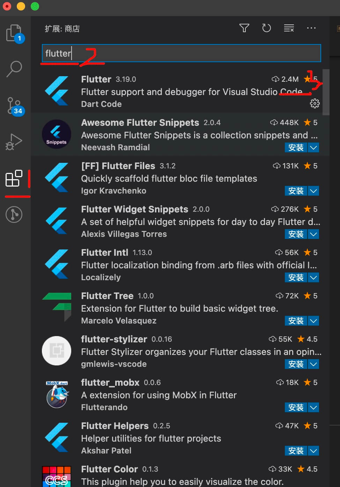

# mac flutter环境搭建

## 安装国内镜像

```javascript
export PUB_HOSTED_URL=https://pub.flutter-io.cn
export FLUTTER_STORAGE_BASE_URL=https://storage.flutter-io.cn
```

## 下载flutter

1. 下载flutter

- [flutter官网下载地址](https://flutter.dev/docs/development/tools/sdk/releases?tab=macos#macos)
- [flutter github下载地址](https://github.com/flutter/flutter/releases)

2. 进入你想放置flutter的目录

```javascript
cd ~/development
```

3. 解压下载文件，记住改为你自己下载的版本号，按Y确认即可
  
```javascript
unzip ~/Downloads/flutter_macos_v0.5.1-beta.zip
```

<image src="./image/03.jpg" width="500" />
  
4. 将flutter添加到path中

```javascript
export PATH=`pwd`/flutter/bin:$PATH
```

此时你会发现，你打开一个新的命令行窗口是，运行`flutter doctor`，会报flutter不存在的错误，是因为环境变量还没全局生效

## 运行flutter

1. 运行`flutter doctor`

错误详情

```javascript
Android toolchain - develop for Android devices (Android SDK version 30.0.2)
    ✗ Android licenses not accepted.  To resolve this, run: flutter doctor
      --android-licenses
[✗] Xcode - develop for iOS and macOS
    ✗ Xcode installation is incomplete; a full installation is necessary for iOS
      development.
      Download at: https://developer.apple.com/xcode/download/
      Or install Xcode via the App Store.
      Once installed, run:
        sudo xcode-select --switch /Applications/Xcode.app/Contents/Developer
        sudo xcodebuild -runFirstLaunch
    ✗ CocoaPods not installed.
        CocoaPods is used to retrieve the iOS and macOS platform side's plugin
        code that responds to your plugin usage on the Dart side.
        Without CocoaPods, plugins will not work on iOS or macOS.
        For more info, see https://flutter.dev/platform-plugins
      To install:
        sudo gem install cocoapods
[!] Android Studio (version 4.1)
    ✗ Flutter plugin not installed; this adds Flutter specific functionality.
    ✗ Dart plugin not installed; this adds Dart specific functionality.
[!] VS Code (version 1.52.0)
    ✗ Flutter extension not installed; install from
      https://marketplace.visualstudio.com/items?itemName=Dart-Code.flutter
[!] Connected device
    ! No devices available
```


**上面的错误信息是告诉你东西未安装完，比如xcode，Android Studio，Android Studio的dart、fultter插件，CocoaPods，VS Code的flutter插件未安装**

2. xcode安装

- 在app store搜索xcode，安装即可
- 运行下面命令
- 再次运行flutter doctor会发现关于xcode的错误消失了

```javascript
sudo xcode-select --switch /Applications/Xcode.app/Contents/Developer
sudo xcodebuild -runFirstLaunch
sudo gem install cocoapods
```

3. Android Studio安装

- [下载安装Android Studio](https://developer.android.com/studio/index.html)
- 打开Android Studio中Preferences，选择Plugins，输入flutter与dart，install安装即可


4. VS Code中flutter插件安装

- 打开vscode，点击扩展，输入flutter，install安装，安装之后重新打开vscode即可



5. 再次运行`flutter doctor`，关于Android Studio相关的错误可能还是有，运行下面的命令

```javascript
// 注意AndroidStudio版本号
ln -s ~/Library/Application\ Support/Google/AndroidStudio4.1/plugins ~/Library/Application\ Support/AndroidStudio4.1
```

1. 再次运行`flutter doctor`，下面这样就都正常了


## 环境变量配置

- 查看flutter的环境配置路径path

```javascript
echo $PATH
// 可以看到flutter的路径为
/Users/name/development/flutter/bin:
```


- 打开环境配置文件

```javascript
open ~/.bash_profile
```

- 或者vim编辑

```javascript
vim ~/.bash_profile
```

- 如果在编辑bash_profile时发现文件不存在

```javascript
// 创建bash_profile文件
touch .bash_profile
```

- bash_profile文件存在时，添加下面内容

```javascript
// 添加国内镜像
export PUB_HOSTED_URL="https://pub.flutter-io.cn"
export FLUTTER_STORAGE_BASE_URL="https://storage.flutter-io.cn"
// 添加安装路径，上面获取到的
export PATH="/Users/name/development/flutter/bin:$PATH"
```

- 更新环境配置

```javascript
source ~/.bash_profile
```

- 重启编辑器即可，会发现在

最终的bash_profile文件

```javascript
// .bash_profile
# HomeBrew
export HOMEBREW_BOTTLE_DOMAIN=https://mirrors.ustc.edu.cn/homebrew-bottles
export PATH="/usr/local/bin:$PATH"
export PATH="/usr/local/sbin:$PATH"
export PUB_HOSTED_URL="https://pub.flutter-io.cn"
export FLUTTER_STORAGE_BASE_URL="https://storage.flutter-io.cn"
# name为自己电脑的名称
export PATH="/Users/name/development/flutter/bin:$PATH"
source ~/.bashrc
# HomeBrew END
```
