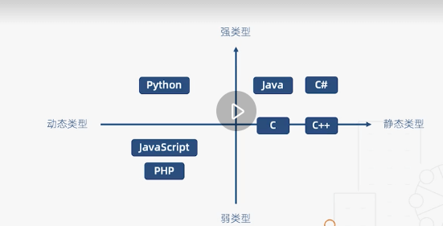

# 基础类型：动态类型与静态类型

名词解释

静态类型语言：在编译阶段确定所有变量的类型

动态类型语言：在执行阶段确定所有变量的类型

```javascript
// 在JavaScript中，在JavaScript编译器执行到这时，完全没有办法确定类型，只有执行到函数、类这来时，才能确定a,b具体为什么类型
class C {
  constructor(x, y) {
    this.x = x;
    this.y = y;
  }
}

function add(a, b) {
  return a.x + a.y + b.x + b.y;
}
```

```c++
// 在c++中，编译阶段就可以确定类型，而且下面例子一定是整型
class C {
  public:
  	int x;
  	int y;
}

int add(C a, C b) {
  return a.x + a.y + b.x + b.y;
}
```

两者对比

| 静态类型语言   | 动态类型语言                     |
| -------------- | -------------------------------- |
| 对类型极度严格 | 对类型非常宽松                   |
| 立即发现错误   | 只有具体运行到这里时才会发现错误 |
| 运行时性能好   | 运行时性能差                     |
| 自文档化       | 可读性差                         |


常见语言区分

