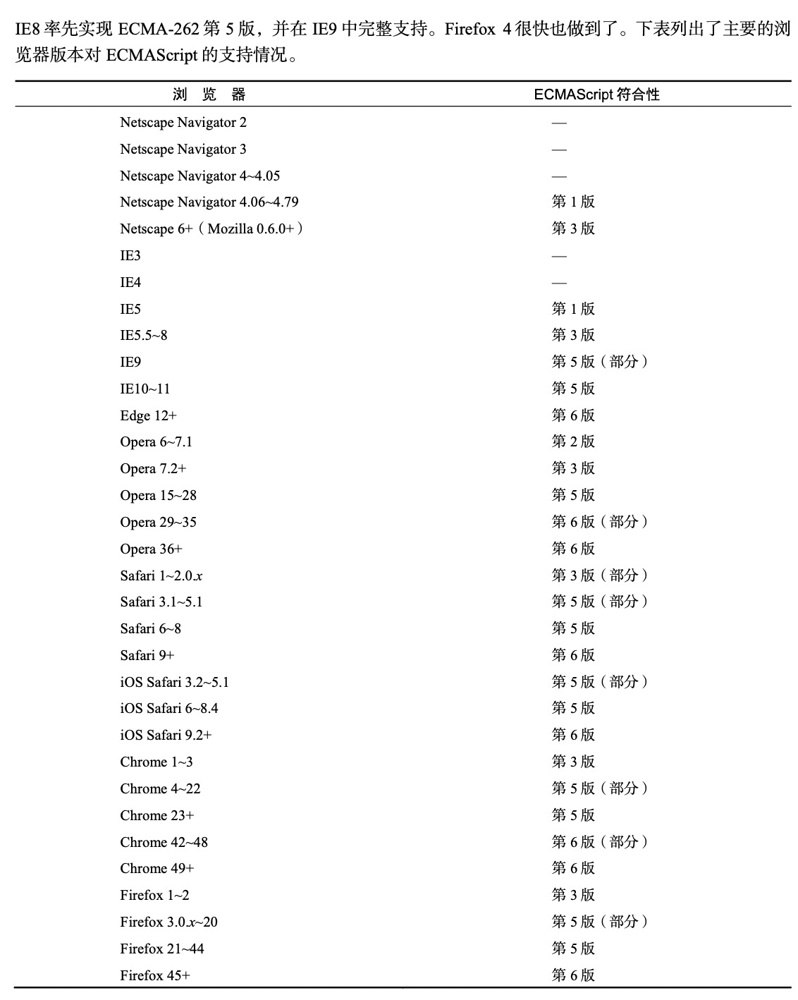
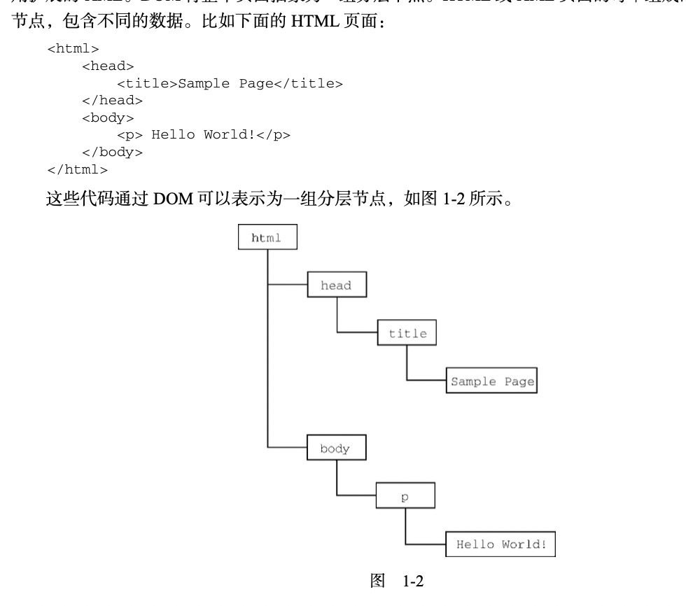
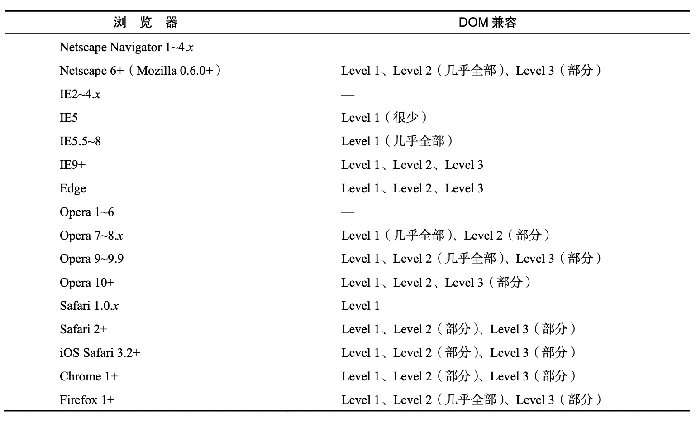
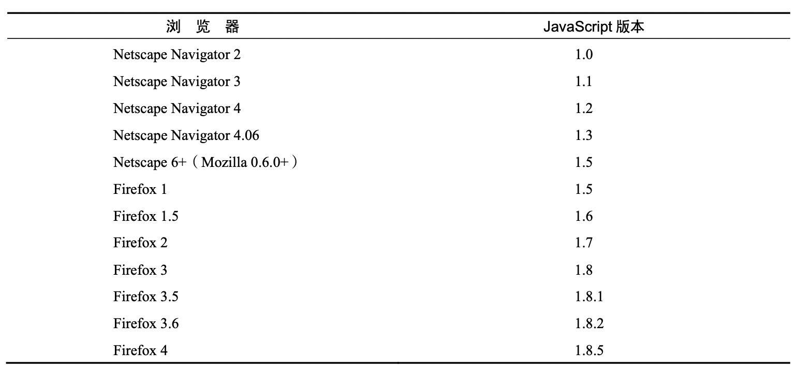

# 什么是javascript

- javascript历史回顾
- javascript是什么
- javascript和ecmascript的关系
- javascript的不同版本

## 1.1 简短的历史回顾

## 1.2 javascript的实现

完整的javascript包含以下几个部分

- 核心 ecmascript
- 文档对象模型 DOM
- 浏览器对象模型 BOM

### 1.2.1 ECMAScript

ECMAScript，即ECMA-262定义的语言，web浏览器只是ECMAScript实现可能存在的一种`宿主环境`。宿主环境提供ECMAScript的基准实现和与环境自身交互必须的扩展。

> ECMA-262定义了什么

- 语法
- 类型
- 语句
- 关键字
- 保留字
- 操作符
- 全局对象

ECMAScript只是对实现这个规范描述的所有方面的一门语言的称呼

> ECMAScript版本

- ECMA-262第6版
  - 称为ES6
  - 支持了类、模块、迭代器、生成器、箭头函数、期约、反射、代理和众多的数据类型
- ECMA-262第7版
  - 称为ES7
  - 只包含少量语法层面的增强，如Array.prototype.includes
- ECMA-262第8版
  - 称为ES8
  - 主要增加了异步函数async/await，sharedArrayBuffer及Atomics API
  - Object.values()/Object.entries()/Object.getOwnPropertyDescriptors()和字符串填充方法
- ECMA-262第9版
  - 称为ES9
  - 异步迭代、剩余、扩展属性、一组新的正则表达式特性、promise finally()、模板字面量修订
- ECMA-262第10版
  - 称为ES10
  - Array.prototype.flat()/flatMap()
  - String.prototype.trimStart()/teimEnd()
  - Object.fromEntries()
  - Symbol.prototype.description
  - Function.prototype.toString()的返回值并固定了Array.prototype.sort()的顺序
  - Json字符串兼容问题
  - 定义了catch子句可选绑定

> ECMAScript符合性是什么意思

要成为ECMAScript时下，必须满足下列条件：

- 支持ECMA-262中描述的所有类型，值、对象、属性、函数以及程序语法和定义
- 支持Unicode字符标准
- 增加ECMA-262未提及的额外的类型、值、对象、函数、属性
- 增加ECMA-262未定义的程序和正则表达式语法

> 各浏览器兼容详情

 

### 1.2.2 DOM

文档对象模型是一个应用编程接口(API)，用于在HTML中使用扩展的XML。DOM将页面抽象为一组分层的节点。HTML和XML页面的每个组成部分都是一种节点

DOM通过创建表示文档的树，让开发者可以随心所欲的控制网页的内容和结构

 

> 为什么DOM是必须的

可以做到不刷新页面而修改页面外观和内容

> DOM级别

- lever1
  - DOM Core + DOM HTML
  - 前者提供一种映射XML文档，方便访问和操作文档任意部分
  - 后者扩展了前者，增加了特定于HTML的对象和方法
- lever2
  - 新增了以下模块
  - DOM视图
  - DOM事件
  - DOM样式
  - DOM遍历和范围
- lever3
  - 增加了以统一的方式加载和保存文档的

> 其他DOM

- 可伸缩矢量图 SVG
- 数学标记语言 MathML
- 同步多媒体集成语言 SMIL

> web浏览器对DOM的支持情况

 

### 1.2.3 BOM

BOM，浏览器对象模型，用于支持访问和操作浏览器的窗口。BOM主要针对浏览器窗口和子窗口

- 弹出新浏览器窗口的能力
- 移动、缩放和关闭浏览器窗口的能力
- navigator对象，提供关于浏览器的详尽信息
- location对象，提供浏览器加载页面的详尽信息
- screen对象，提供关于用户屏幕分辨率的信息
- performance对象，提供浏览器内存占用、导航行为和时间统计的信息
- 对cookie的支持
- 其他自定义对象，如XMLHttpRequest和IE的ActiveXObject

## 1.3 javascript版本

 

## 1.4 小结

javascript是一门用来与网页交互的脚本语言，包含以下三个部分

- ECMAScript：由ECMA-262定义并提供核心功能
- 文档对象模块DOM：提供与网页内容交互的方法和接口
- 浏览器对象模型BOM：提供与浏览器交互的方法与接口

下一节：[02-HTML中的javascript](02-HTML中的javascript.md)

