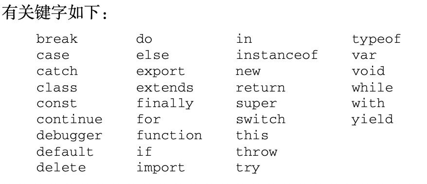
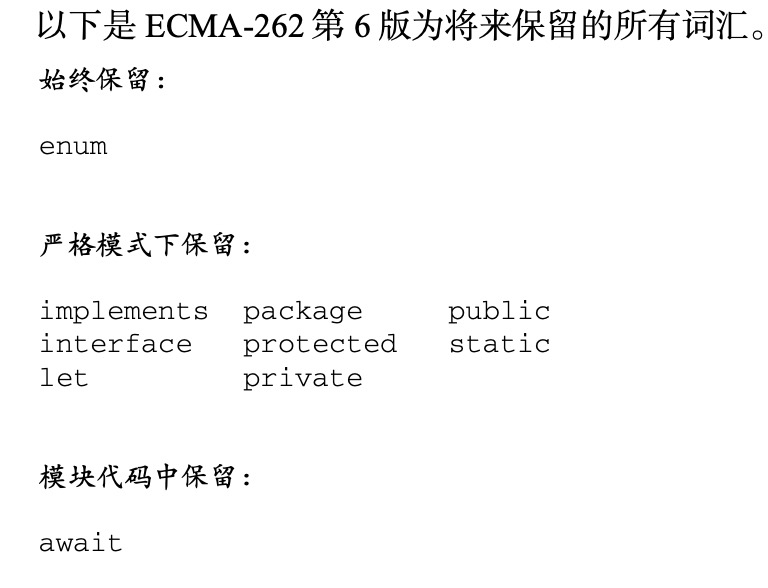
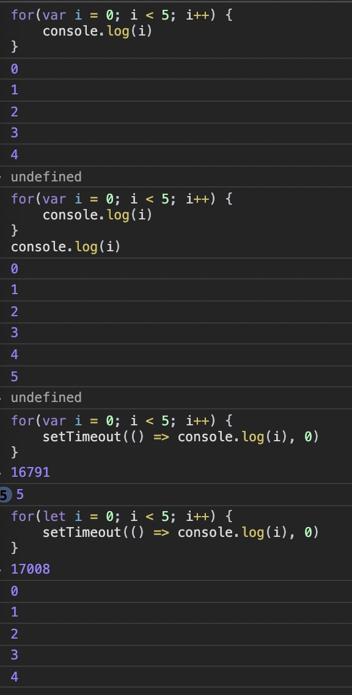
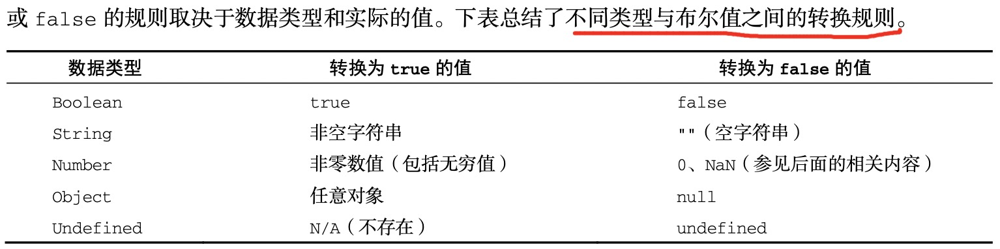
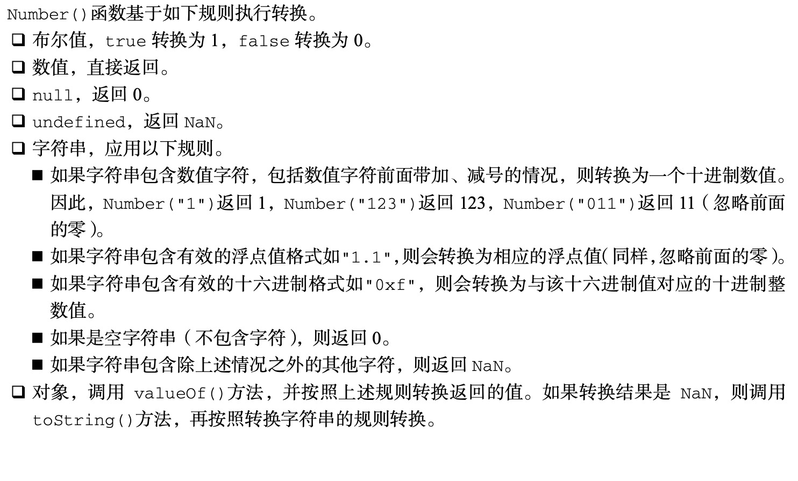
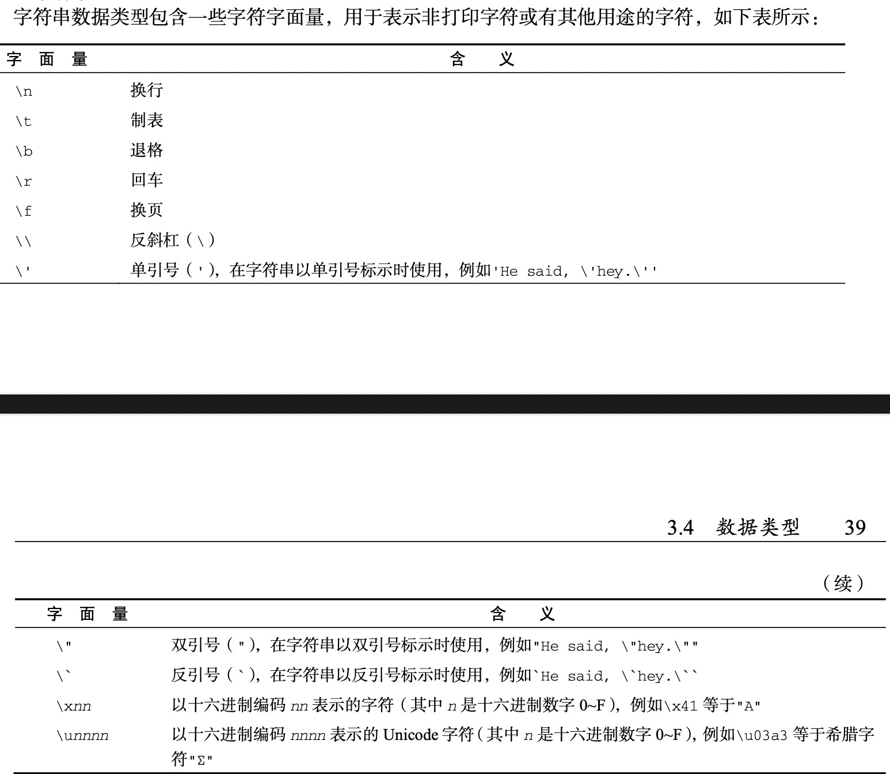

# 语言基础

学习目标：

- 语法
- 数据类型
- 流控制语句
- 理解函数

## 3.1 语法

### 3.1.1 区分大小写

ECMAScript 中一切都区分大小写，无论是变量、函数名还是操作符

```
// 两个不同的变量
let test

let Test

// 两个不同的函数
function test(){}

function Test(){}
```

### 3.1.2 标识符

- 标识符，就是变量、函数、属性或函数参数的名称
  - 第一个字符必须是一个字母、下划线(_)或美元符号($)
  - 剩下的其他字符可以是字母、下划线、美元符号或数字
- ECMAScript 标识符使用驼峰大小写形式

### 3.1.3 注释

- 单行注释和块注释

```
// 单行注释
// let a = 1

// 块注释
/*
  let a = 1
  let b = 2
*/
```

### 3.1.4 严格模式

严格模式是一种不同的 JavaScript 解析和执 行模型，ECMAScript 3 的一些不规范写法在这种模式下会被处理，对于不安全的活动将抛出错误

使用方式：

```
// a.js
"use strict"
...
...

// 方法中使用
function a () {
  "use strict"
}
```

### 3.1.5 语句

ECMAScript 中的语句以分号结尾。省略分号意味着由解析器确定语句在哪里结尾

> 加分号的好处

- 加分号有助于防止省略造成的问题，比如输入不完整
- 加分号也便于开发者通过删除空行来压缩代码，如果没有结尾的分号，只 删除空行，则会导致语法错误
- 加分号也有助于在某些情况下提升性能，因为解析器会尝试在合适的 位置补上分号以纠正语法错误

> 多条语句

- 代码块由一个左花括号({)标识开始，一个右 花括号(})标识结束
- if 之类的控制语句只在执行多条语句时要求必须有代码块。不过，最佳实践是始终在控制语句中 使用代码块，即使要执行的只有一条语句

```
// good
if (a) {
  console.log(a)
}
// bad
if (a)
  console.log(a)
```

## 3.2 关键字与保留字

> 关键字列表



> 保留字列表




## 3.3 变量

ECMAScript 变量是松散类型的，意思是变量可以用于`保存任何类型的数据`

> 声明变量的三种方式

- var
- let es6
- const es6

### 3.3.1 var关键字

> var声明变量的特点

- 可以保存如何类型的值，也可以把值修改为任何类型的其它值(01)
- var声明作用域，使用 var 操作符定义的变量会成为包含它的函数的局部变量，在函数调用后销毁(02)
- 不使用var声明变量时，会创建一个全局变量(03)
  - 不推荐使用全局变量，并且在严格模式下使用全局变量会报错
- var声明提升(04)


```
// 01
var a = 'xcc'
a = 100
```

```
// 02
function test() {
  var a = 'xcc'
}
test()

console.log(a)  // 报错
```

```
// 03
function test() {
  a = 'xcc'
}
test()

console.log(a)  // xcc
```

```
// 04
function test() {
  console.log(a)  // undefined
  var a = 'xcc'
}
test()

// 等价于
function test() {
  var a
  console.log(a)  // undefined
  a = 'xcc'
}
test()
```

### 3.3.2 let声明

> let声明的特点

- let 声明的范围是块作用域， 而 var 声明的范围是函数作用域(05)
- let 也不允许同一个块作用域中出现冗余声明(06)
- let声明会出现`暂时性死区`(07)
- let声明不是全局声明(08)
  - 使用 let 在全局作用域中声明的变量不会成为 window 对象的属性
  - let 声明仍然是在全局作用域中发生的，相应变量会在页面的生命周期内存续。因此，为了 避免 SyntaxError，必须确保页面不会重复声明同一个变量
- 条件声明(09)
  - let 的作用域是块，所以不可能检查前面是否已经使用 let 声明过同名变量，同 时也就不可能在没有声明的情况下声明它
- for循环中的let声明(10)
  - 使用 var 声明迭代变量时，JavaScript 引擎修改的都是同一个迭代变量
  - 使用 let 声明迭代变量时，JavaScript 引擎在后台会为每个迭代循环声明一个新的迭代变量


```
// 05
// var声明
if (true) {
  var a = 'xcc'
  console.log(a)
}
console.log(a)  // xcc

// let声明
if (true) {
  let a = 'xcc'
  console.log(a)
}
console.log(a)  // 报错
```

```
// 06
let a = 'xcc'
let a = 20  // 报错
```

```
// 07
// var
console.log(a)  // undefined
var  a = 'xcc'

// let
console.log(a)  // 报错
let a = 'xcc'
```

```
// 08
// var
var a = 100
console.log(window.a) // 100

// let
let a = 100
console.log(window.a) // undefined
```

```
// 09
<script>
  var a = 100
  let b = 10
</script>
<script>
  var a = 200
  let b = 20  // 报错
</script>
```

```
// 10
// var
for(var i = 0; i < 5; i++) {
  // 逻辑
}
console.log(i)  // 5

// let
for(let i = 0; i < 5; i++) {
  // 逻辑
}
console.log(i)  // 错误
```



### 3.3.3 const声明

> const声明的特点

- const相比let，在声明变量时必须同时设置初始化变量，并且在尝试修改const声明的变量时会导致运行时错误(11)
- 修改const声明的变量，数据为基本数据类型时修改会报错，引用数据类型时没问题(12)
- 不能用 const 来声明迭代变量(13)
  - 在for循环中，let声明的迭代变量会自增，不会有问题，但是const声明的迭代变量出现自增时会报错
- 


```
// 11
// let
let a
let b = 10
b = 20

// const
const a // 错误
const b = 10
b = 20  // 错误
```

```
// 12
// 基本数据类型
const a = 10
a = 20  // 错误

// 引用数据类型
const b = []
b.push(1)
```

```
// 13
// let
for(let i = 0; i < 5; i++) {

}

// const
for(const i = 0; i < 5; i++) {  // 报错

}
```

### 3.3.4 声明风格及最佳实践

- 不使用var
- const优先，let次之


## 数据类型

ECMAScript 有 6 种简单数据类型(也称为原始类型):Undefined、Null、Boolean、Number、 String 和 Symbol。Symbol(符号)是 ECMAScript 6 新增的。还有一种复杂数据类型叫 Object

- 原始类型
  - Undefined、Null、Boolean、Number、 String、Symbol
- 复杂数据类型
  - Object


### 3.4.1 typeof操作符

因为 ECMAScript 的类型系统是松散的，所以需要一种手段来确定任意变量的数据类型

- undefined表示值未定义
- boolean表示布尔值
- string表示字符串
- number表示数值
- object表示对象或者null
- function表示函数
- symbol表示符号

```
console.log(typeof undefined) // undefined
console.log(typeof true) // boolean
console.log(typeof 'xcc') // string
console.log(typeof 1) // number
console.log(typeof {}) // object
// null 值表示一个空对象指针
console.log(typeof null) // object
console.log(typeof function(){}) // function
console.log(typeof Symbol) // function
```

### 3.4.2 undefined类型

- Undefined 类型只有一个值，就是特殊值 undefined
- 使用 var 或 let 声明了变量但没有初始 化时，就相当于给变量赋予了 undefined 值
- 未声明的变量，typeof类型也为undefined


```
// 声明的变量
let a
console.log(typeof a) // undefined

console.log(typeof b) // undefined
```

### 3.4.3 null类型

- Null 类型同样只有一个值，即特殊值 null
- null 值表示一个空对象指针，这也是给 typeof 传一个 null 会返回"object"的原因


```
console.log(null == undefined)  // true
```

### 3.4.4 boolean类型

- Boolean(布尔值)类型是 ECMAScript 中使用最频繁的类型之一，有两个字面值:true 和 false。 这两个布尔值不同于数值，因此 true 不等于 1，false 不等于 0
- 布尔值字面量 true 和 false 是区分大小写的




### 3.4.5 number类型

- Number 类型使用 IEEE 754 格式表示整数和浮点值
- 可以用二进制、八进制、十进制、十六进制表示，默认采用十进制表示

> 浮点值

- 要定义浮点值，数值中必须包含小数点，而且小数点后面必须至少有一个数字
- 浮点值容易出现精度丢失问题

```
console.log(0.1 + 0.2 === 0.3) // false
```

> 值的范围

- ECMAScript 可以表示的最小 数值保存在 Number.MIN_VALUE 中，这个值在多数浏览器中是 5e324;可以表示的最大数值保存在 Number.MAX_VALUE 中，这个值在多数浏览器中是 1.797 693 134 862 315 7e+308
- 如果遇到表示不了的值，会展示位-Infinity与Infinity

> 特殊的NaN

- 用于表示本来要返回数值的操作失败了，而不是错误
- 任何涉及 NaN 的操作始终返回 NaN


```
console.log(0/0)  // NaN
console.log(NaN === NaN)  // false
console.log(NaN + 1)  // NaN
```

> 数值转换

- 用来将非数值转换为数值
- Number()
  - 用于任何数据类型
- parseInt()
  - 主要用于字符串
- parseFloat()
  - 主要用于字符串

Number数值转换规则：

```
Number(true)  // 1
Number(1) // 1
Number('123') // 123
Number(null)  // 0
Number(undefined) // NaN
```




### 3.4.6 string类型

- String(字符串)数据类型表示零或多个 16 位 Unicode 字符序列。字符串可以使用双引号(")、 单引号(')或反引号(`)标示
- 字符字面量
- 字符串的特点
  - ECMAScript 中的字符串是不可变的(immutable)，意思是一旦创建，它们的值就不能变了
- 转换为字符串
  - toString()方法
- 模板字面量
  - 模板字面量 保留换行字符，可以跨行定义字符串
- 字符串插值
  - 可以在一个连续定义中插入一个或多个 值
- 模板字面量标签函数
  - 模板字面量也支持定义标签函数(tag function)，而通过标签函数可以自定义插值行为。标签函数 会接收被插值记号分隔后的模板和对每个表达式求值的结果
- 原始字符串
  - 使用模板字面量也可以直接获取原始的模板字面量内容(如换行符或 Unicode 字符)，而不是被转 换后的字符表示



### 3.4.7 symbol类型

- 符号是原始值，且符号实例是唯一、不可变的
- 符号的用途是确保对象属性使用唯一标识符，不会发生属性冲突的危险


