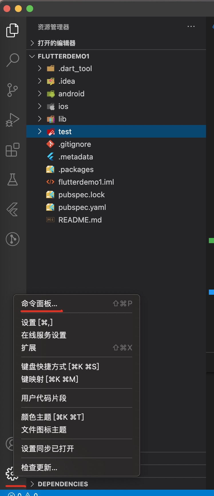
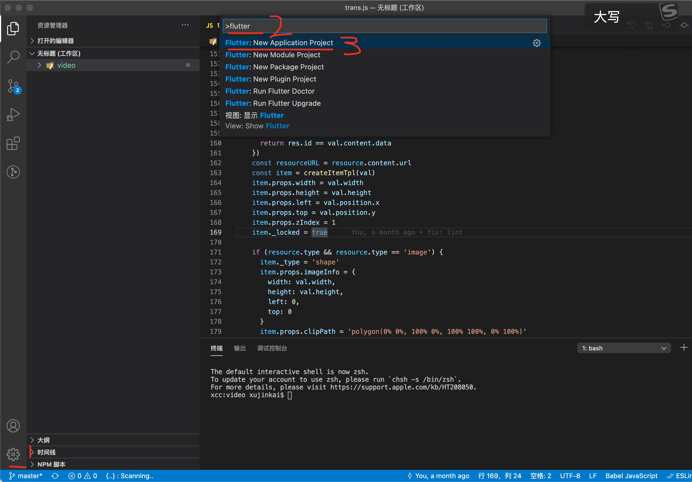
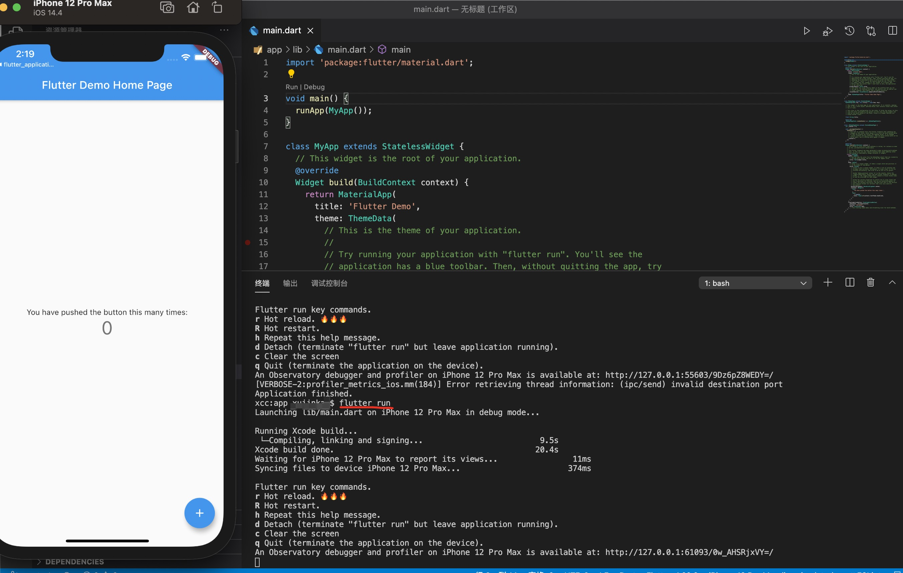

# 编写第一个flutter应用

- [吐血推荐flutter官方教程-怎么写一个flutter应用1](https://flutter.cn/docs/get-started/codelab)
- [编写一个flutter应用2](https://codelabs.flutter-io.cn/codelabs/first-flutter-app-pt2-cn/index.html#8)

你可以学到的：

- 怎么初始化一个flutter项目
- 学习怎么调用外部package
- 怎么使用热重载
- 怎么实现有状态的widget
- 怎么做一个页面路由(router)
- 怎么实现页面交互
- 怎么修改应用主题

**启动项目的前提是对应的xcode Android Studio环境安装完全**

## 初始化一个flutter项目

### 通过flutter 命令创建

1. 查看flutter安装是否成功

```
flutter doctor
```

安装正确会出现下面这样的提示👇：

```
Doctor summary (to see all details, run flutter doctor -v):
[✓] Flutter (Channel stable, 1.22.6, on macOS 11.2.1 20D74 darwin-x64, locale zh-Hans-CN)
 
[✓] Android toolchain - develop for Android devices (Android SDK version 30.0.2)
[✓] Xcode - develop for iOS and macOS (Xcode 12.4)
[✓] Android Studio (version 4.1)
[✓] VS Code (version 1.52.0)
[✓] Connected device (1 available)

• No issues found!
```

如果安装错误，按照[环境搭建中的安装flutter](./01-flutter环境搭建.md)

2. 初始化创建项目

创建项目名为app的flutter项目

```
flutter create app
```

初始化创建成功会出现下面提示

```
All done!
[✓] Flutter: is fully installed. (Channel stable, 1.22.6, on macOS 11.2.1 20D74 darwin-x64, locale zh-Hans-CN)
[✓] Android toolchain - develop for Android devices: is fully installed. (Android SDK version 30.0.2)
[✓] Xcode - develop for iOS and macOS: is fully installed. (Xcode 12.4)
[✓] Android Studio: is fully installed. (version 4.1)
[✓] VS Code: is fully installed. (version 1.52.0)
[✓] Connected device: is fully installed. (1 available)

In order to run your application, type:

  $ cd app
  $ flutter run

Your application code is in app/lib/main.dart.
```

3. 运行flutter项目

```
cd app
flutter run
```

会自动打开模拟器，并出现下面的提示信息

```
Launching lib/main.dart on iPhone 12 Pro Max in debug mode...
 
Running Xcode build...                                                  
 └─Compiling, linking and signing...                        87.2s
Xcode build done.                                           114.1s
Waiting for iPhone 12 Pro Max to report its views...                 4ms
Syncing files to device iPhone 12 Pro Max...                       353ms

Flutter run key commands.
r Hot reload. 🔥🔥🔥
R Hot restart.
h Repeat this help message.
d Detach (terminate "flutter run" but leave application running).
c Clear the screen
q Quit (terminate the application on the device).
An Observatory debugger and profiler on iPhone 12 Pro Max is available at: http://127.0.0.1:55603/9Dz6pZ8WEDY=/
```

### 通过vscode flutter插件创建项目

1. 打开vscode，点击扩展，输入flutter，点击install安装flutter依赖
2. 点击管理->命令面板，输入flutter，选择Flutter: New Application Project
3. 指定项目的创建文件，然后输入项目名称
4. 等待一下后，会发现项目创建成功，在项目根目录运行启动命令运行flutter项目


```
// 启动项目
flutter run
```







## 使用外部package

1. 在项目根目录`pubspec.yaml`文件中管理依赖，比如新增包`english_words`

```
dependencies:
  flutter:
    sdk: flutter

  cupertino_icons: ^1.0.0
  english_words: ^3.1.5
```

2. 安装依赖

```
// 根目录命令行运行下面命令
flutter pub get
```

3. 使用依赖

```
import 'package:flutter/material.dart';
import 'package:english_words/english_words.dart';

void main() => runApp(MyApp());

class MyApp extends StatelessWidget {
  @override
  Widget build(BuildContext context) {
    final wordPair = WordPair.random();
    return MaterialApp(
      title: 'Welcome to Flutter',
      home: Scaffold(
        appBar: AppBar(
          title: Text('Welcome to Flutter'),
        ),
        body: Center(
          child: Text(wordPair.asPascalCase),
        ),
      ),
    );
  }
}
```

[查找更多flutter相关依赖](https://pub.flutter-io.cn/)

## 热重载

在通过`flutter run`运行的命令下，输入`r`即可完成热重载

几个常见的命令：

```
Flutter run key commands.
r Hot reload. 🔥🔥🔥
R Hot restart.
h Repeat this help message.
d Detach (terminate "flutter run" but leave application running).
c Clear the screen
q Quit (terminate the application on the device).
```

## 有状态的widget

## 页面路由(router)

通过Navigator.of来实现路由的具体实现

```
Navigator.of(context).push(
  new MaterialPageRoute<void>(
    builder: (BuildContext context) {
      
    },
  ),
);
```

## 页面交互

通过`onTap`来实现页面交互，使用setState改变对应状态

```
onTap: () {
  setState(() {
    if (alreadySaved) {
      _saved.remove(pair);
    } else {
      _saved.add(pair);
    }
  });
}
```

## 主题

通过`new ThemeData()`来实现主题的切换

```
MaterialApp(
  title: 'Startup Name Generator',
  theme: new ThemeData(
    primaryColor: Colors.white,
  ),
  home: RandomWords(),
)
```
