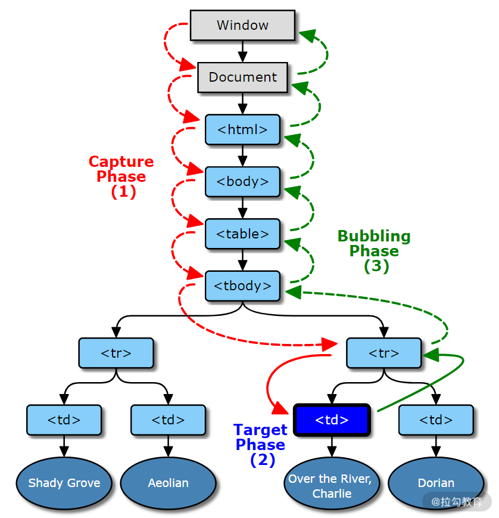

## DOM事件

- 常见的三种常见，防抖，节流，代理

### 防抖

- 场景：输入框输入信息，对输入信息做实时检索，通过接口与后端进行交互，不需要通过点击搜索按钮完成检索
- 问题：在input的onchange事件中进行实时请求，当输入框输入发生改变时就会发送一次请求。比如输入react
  - 在输入r时，接口发出请求，输入re时，发出请求，输入rea时，发出请求，输入reac时，发出请求，输入react时，发出请求
  - 可是这个输入中，只有输入react时发出的一次请求是有效的
- 解决方式：添加防抖功能，设置一个合理的时间间隔，避免时间在时间间隔内频繁触发，同时又能保证输入后可以看到结果

```
  // 代码1
  // 每次value改变，就会发出一次请求
  <input onChange={handleChange} />

  const handleChange = async ({target: { value }}) => {
    const res = await search({ keyword: value })
  }
```


```
  // 代码2
  // 通过定时器。设置时间间隔500ms执行一次请求
  <input onChange={handleChange} />

  let timer = null
  const handleChange = ({target: { value }}) => {
    if(timer) {
      clearTimeout(timer)
      timer = null
    }
    timer = setTimeout(async () => {
      const res = await search({ keyword: value })
    }, 500)
  }
```

```
  // 代码3
  // 公共函数抽取
  /*
    应有的功能
    1. 参数和返回值如何传递？
    2. 防抖之后函数是否可以立即执行？
    3. 防抖的函数是否可以取消？
  */

  const debounce = (func, wait = 0) => {
    let timer = null
    let args
    function debounced(...age) {
      args = arg
      if(timer) {
        clearTimeout(timer)
        timer = null
      }

      // 以promise形式返回函数执行结果
      return new Promise((res, rej) => {
        timer = setTimeout(async () => {
          try {
            const result = await func.apply(this, args)
            res(result)
          } catch (e) {
            rej(e)
          }
        }, wait)
      })
    }
    // 取消方法
    function cancel() {
      clearTimeout(timer)
      timer = null
    }
    // 立即执行
    function fulsh() {
      cancel()
      return func.apply(this, args)
    }
    debounced.cancel = cancel
    debounced.flush = flush
    return debounced
  }
```


### 节流

- 原理：设置在指定的一段时间内，只调用一次函数，重而降低函数的调用频率
- 场景1：改变浏览器窗口大小事件监听
- 场景2：左右布局页面，左侧为目录，右侧为内容，内容滚动时左侧目录当前项高亮


### 代理

- 对具有相同父节点，事件监听函数逻辑一致，只是参数不同时，通常会采用事件代理和时间委托来优化
- 场景：业务中常见的列表，编辑或者删除操作，除了传入的每条数据的id不同，一般其他的都一致


#### 事件触发流程

1. 捕获阶段：事件对象window传播到目标的父对象，红色过程
2. 目标阶段：事件对象到达事件对象的时间目标，蓝色过程
3. 冒泡阶段：时间对象从目标对象的父节点开始回到window，绿色过程



#### DOM事件标准

- 下面3中监听方式的区别
- 方式1和方式2属于DOM0标准，通过这种方式进行事件监听会覆盖之前的事件监听函数
- 方式3属于DOM2标准，同一元素上的事件监听函数互不影响，而且可以独立取消，调用顺序和监听顺序一致

- 方式1：`<input type='text' onclick='click()' />`
- 方式2：`document.querySelecter('input').onClick = function(e) {}`
- 方式3：`document.querySelecter('input').addEventListener('click', function(e) {})`

```
  <ul class='list'>
    <li class='item'>item1<span class='edit'>编辑</span><span class='delete'>删除</span></li>
    <li class='item'>item1<span class='edit'>编辑</span><span class='delete'>删除</span></li>
    <li class='item'>item1<span class='edit'>编辑</span><span class='delete'>删除</span></li>
    ...
  </ul>
```

```
  const ul = document.querySelector('.list')
  ul.addEventListener('click', e => {
    const t = e.target || e.srcElement
    if (t.classList.contains('item')) {
      // 接口请求处理业务逻辑
    } else {
      id = t.parentElement.id
      if (t.classList.contains('edit')) {
        edit(id)
      } else if (t.classList.contains('delete')) {
        del(id)
      }
    }
  })

```
