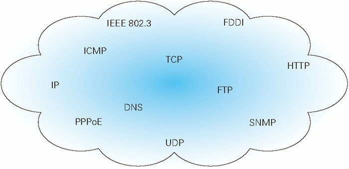
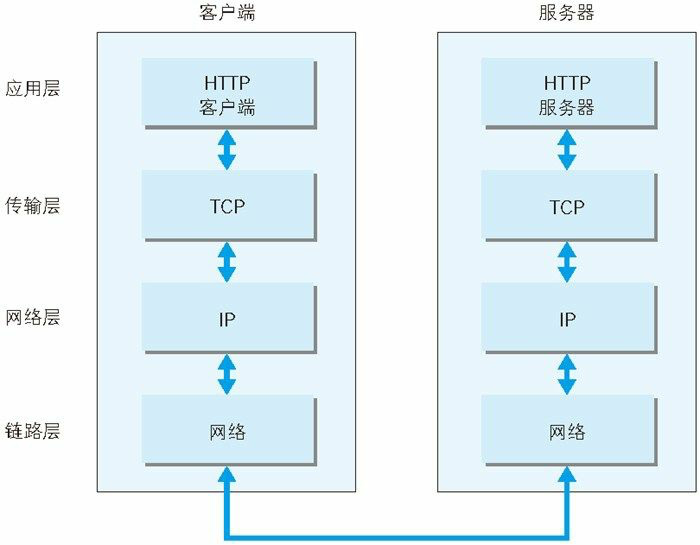
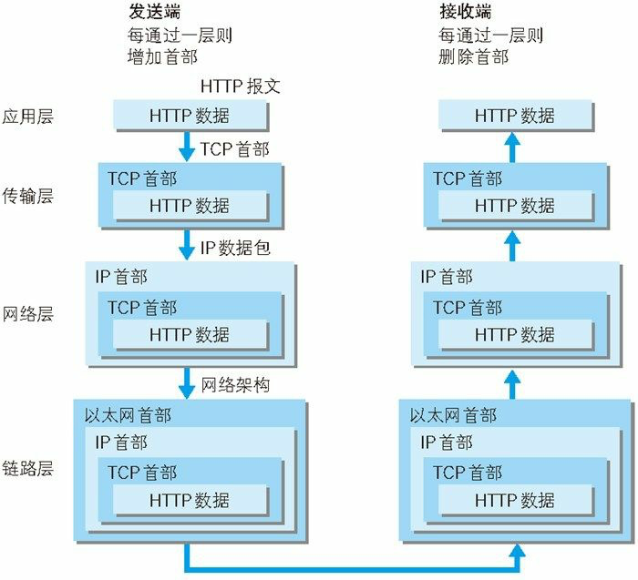

<!--
 * @Author: your name
 * @Date: 2021-01-09 16:40:37
 * @LastEditTime: 2021-01-11 10:18:23
 * @LastEditors: Please set LastEditors
 * @Description: In User Settings Edit
 * @FilePath: /zao/Users/xujinkai/Documents/docs/notes/docs/图解HTTP/01-了解web及网络基础.md
-->

# 了解 web 及网络基础

## 1.1 使用 HTTP 协议任何访问 web

在网络浏览器的地址栏中输入 URL，web 页面是如何呈现的？

根据 web 浏览器中的 URL，客户端通过发送 HTTP 请求，浏览器从 web 服务器获取文件资源信息

HTTP 是超文本传输协议规范，完成从客户端到服务端的运作

## 1.2 HTTP 的诞生

### 1.2.1 为知识共享而规划 web

基本理念：借助多文档之间相互关联形成的超文本(HyperText)，连接可以相互参阅的 WWW(World Wide Web)

- WWW 包含

1. SGML(Standard Greneralized Markup Language-标准通用标记语言)作为页面文本标记语言的 HTML
2. 作为文档传递协议的 HTTP
3. 指定文档地址的 URL(Uniform Resource Locator-统一资源定位)

### 1.2.3 驻足不前的 HTTP

- HTTP/0.9: 1990 年问世
- HTTP/1.0: 1996 年 5 月，记载于 RFC1945 标准
- HTTP/1.1: 1997 年 1 月，修订版本 RFC2616

## 1.3 网络基础 TCP/IP

网络是在 TCP/IP 协议族的基础上运作的，而 HTTP 属于它内部的一个子集

### 1.3.1 TCP/IP 协议族

计算机与网络设备要相互通信，双方就必须基于相同的方法。不同的硬件，操作系统之间的通信，所有的这一切都需要一种规则。而这个规则称为协议(protocol)

协议中存在各种各样的内容，比如 IP 地址的选定，异地用户，建立通信的顺序，web 页面显示需要处理的步骤。像这样吧互联网相关联的协议集合起来总称为 TCP/IP

### 1.3.2 TCP/IP 的分层管理

- TCP/IP 协议族分层

1. 应用层
2. 传输层
3. 网络层
4. 数据链路层

#### 应用层

应用层决定了用户提供应用服务时通信的活动

TCP/IP 协议族预存了各类通用的应用服务，比如 FTP(File Transfer Protocol-文件传输协议)，DNS(Domain Name System-域名系统)。HTTP 协议也处于这一层

#### 传输层

传输层对上层应用层，提供处于网络连接中的两台计算机之间的数据传输

传输层有的协议

TCP(Transmission Control Protocol-传输控制协议)

UDP(User Data Protocol-用户数据协议)

#### 网络层

网络层是用来处理网络上流动的数据包，数据包是网络传输的最小数据单位。这一层规定通过怎么样的路径到达对方计算机，并把数据包传给对方

#### 链路层-又名数据链路层，网络接口层

用来处理连接网络的硬件部分，包括操作系统，硬件驱动，NIC(Network Interface Card，网络适配器即网卡)，以及光纤等物理可见部分

### 1.3.3 TCP/IP 通信传输流

