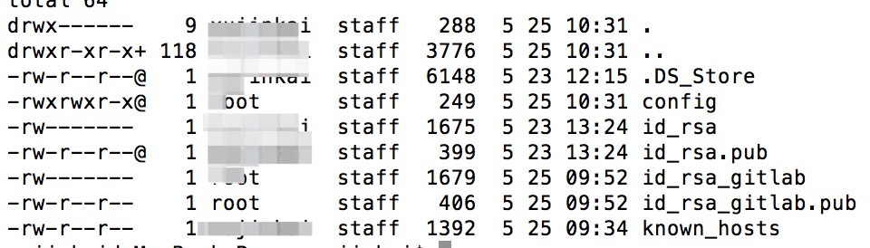

<!--
 * @Author: your name
 * @Date: 2020-05-25 10:36:40
 * @LastEditTime: 2020-05-25 11:50:10
 * @LastEditors: Please set LastEditors
 * @Description: In User Settings Edit
 * @FilePath: /song/Users/xujinkai/Desktop/docs/notes/git在github与gitlab同时使用.md
--> 


1. git bash 运行命令```ls -al ~/.ssh```，查看.ssh文件下是否有生成秘钥文件
2. 如果目录下没有.ssh文件，使用```mkdir ~/.ssh```生成.ssh文件，同时```chmod 700 ~/.ssh```给权限
3. 如果有.ssh文件，运行```cd ~/.ssh```到.ssh文件下，输入```ls```命令查看秘钥文件
4. 生成秘钥文件

```
  // 生成github秘钥
  ssh-keygen -t rsa -C 'github登录的邮箱' -f ~/.ssh/id_rsa_github
  // -t指定秘钥类型，默认rsa
  // -C 设置注释文字，比如邮箱
  // -f 指定秘钥文件名称
  // 按enter，不输入用户名与密码
  // 会生成文件名为id_rsa_github与id_rsa_github.pub两个文件

  // 同理生成gitlab秘钥
  ssh-keygen -t rsa -C 'gitlab登录的邮箱' -f ~/.ssh/id_rsa_gitlab
  // 会生成文件名为id_rsa_gitlab与id_rsa_gitlab.pub两个文件
```
5. 运行ls命令应该就可以看到生成的秘钥文件了，把id_rsa_github.pub与id_rsa_gitlab.pub文件分别存放到github与gitlab的Settings中的SSH Keys中即可
6. 配置.ssh文件下的config文件

```
  // 进入.ssh文件
  cd ~/.ssh
  // 给config文件添加权限，不然在vim文件保存时会提示权限不足
  // 错误提示
  // .ssh/config" E212: Can't open file for writing
  // Press ENTER or type command to continue
  sudo touch config
  sudo chown root:root config
  sudo chmod 755 config
  whoami
  vim config
  // 在config文件中输入下面内容，注意文件名id_rsa_gitlab与id_rsa_github写为自己的文件名
  #gitlab
  Host gitlab
        HostName gitlab.*.com
        PreferredAuthentications publickey
        IdentityFile ~/.ssh/id_rsa_gitlab

  #github
  Host github
          AddKeysToAgent yes
          UseKeychain yes
          HostName github.com
          PreferredAuthentications publickey
          IdentityFile ~/.ssh/id_rsa_github
  // 输入结束后按esc，退出vim编辑模式，按i进入vim编辑模式
  // 输入shift+:，然后输入wq，保存并退出vim
```

7. ***运行命令```sudo ssh-add ~/.ssh/id_rsa_gitlab```与```sudo ssh-add ~/.ssh/id_rsa_github```***，一定要执行
8. 运行命令```sudo ssh -T git@github.com```与```sudo ssh -T git@gitlab.com```，测试一下是否成功