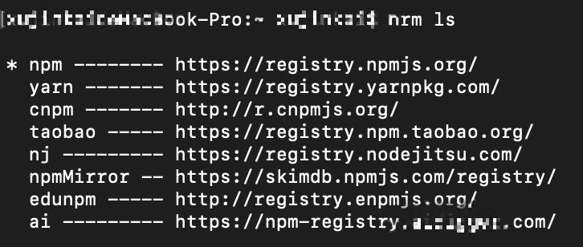

# npm镜像的常见操作

## 背景

公司内容搭建了自己的npm仓库，下载内部npm包时，必须通过内部的npm源来安装依赖，否则安装不成功。当个人要发布npm包时，经常需要来回切换npm源，比较麻烦，特此记录一下操作过程

## npm与yarn的区别

### yarn

本质还是安装的npm上的包，依赖包的仓库不会变，所以安装下来的包没有什么区别

- 是新出的一个JS包管理工具，是为了弥补npm的一些缺陷而出现的
- 相比npm，yarn运行速度更快
- 离线模式：再次安装某个包会从缓存中获取
- 安装版本统一：通过`yarn.lock`文件来记录安装版本
- 更简洁的输出
- 并行安装

### npm

JS包管理平台，但是安装速度不够快，拉取的package包版本可能不一致，同时npm允许安装package时执行代码，存在安全隐患


## 常见的源

```
  npm: https://registry.npmjs.org/

  cnpm: https://r.cnpmjs.org/

  taobao: https://registry.npm.taobao.org/

  nj: https://registry.nodejitsu.com/

  rednpm: https://registry.mirror.cqupt.edu.cn/

  npmMirror: https://skimdb.npmjs.com/registry/

  deunpm: http://registry.enpmjs.org/
```

## 修改，新增，切换镜像地址

### 编辑源配置文件

在命令行工具输入`npm config edit`即可对本机镜像进行查看编辑

```
  npm config edit
```

### 修改镜像

假设修改为淘宝镜像

- npm

```
  // 查看npm当前镜像源
  npm config get registry
  // 设置npm镜像源为淘宝镜像
  npm config set registry https://registry.npm.taobao.org/
```

- yarn

```
  // 查看yarn当前镜像源
  config get registry
  // 设置yarn镜像源为淘宝镜像
  yarn config set registry https://registry.npm.taobao.org/
```

## 通过nrm管理镜像

- 全局安装nrm

```
  npm install nrm -g
```

- 查看镜像列表

```
  nrm ls
```



- 切换镜像

```
  nrm use yarn
```

- 添加镜像

```
  nrm add yarn https://registry.yarnpkg.com/
```

- 删除镜像

```
  nrm del yarn
```

- 镜像测速

```
  nrm test yarn
```

- 查看更多nrm命令

[nrm文档](https://www.npmjs.com/package/nrm)


