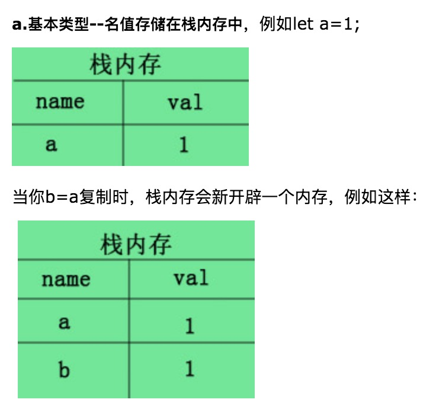
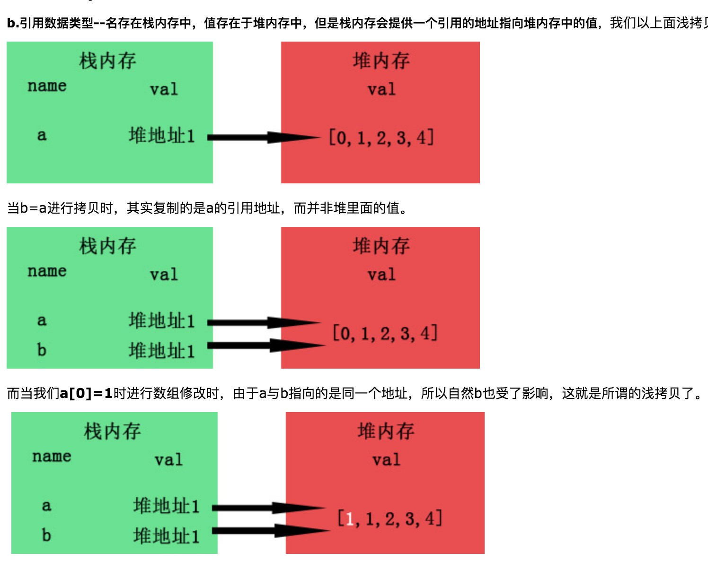

### 基本类型

1. Undefined，Null，Boolean，Number，String，Symbol(es6)，BigInt(es10)  
2. 基本数据类型是按值访问的，***可以操作和保存在变量中的实际的值***  
3. 数据存储在栈内存中，栈具有先进后出的性质  
4. 基本类型值的复制，实际是复制了一个值的副本(一个和原来没关系的值，大小什么的相等)  

基本类型图解




### 引用类型
1. Object，Array，Function  
2. ***引用类型的值是保存在内存中的对象***，js中不允许直接访问内存中的数据，***对象的操作实际上是改的对象的引用而不是实际的对象***
3. 引用类型的**指针存放在栈内存中，引用类型的值存储在堆内存中**
4. 引用类型的复制，实际复制的是指针(就是指向了同一个对象)

引用类型图解



```
  // 基本类型
  var a = 1
  var b = a
  a = 2
  console.log(b) // 1
  // 引用类型
  var obj = {a: 1}
  var obj1 = obj
  obj.a = 2
  console.log(obj1) // {a: 2}
```