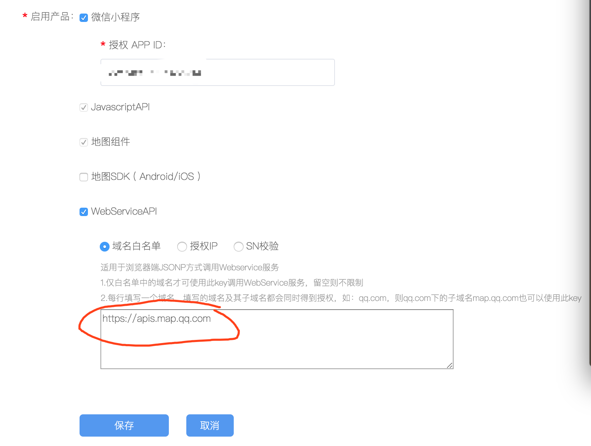
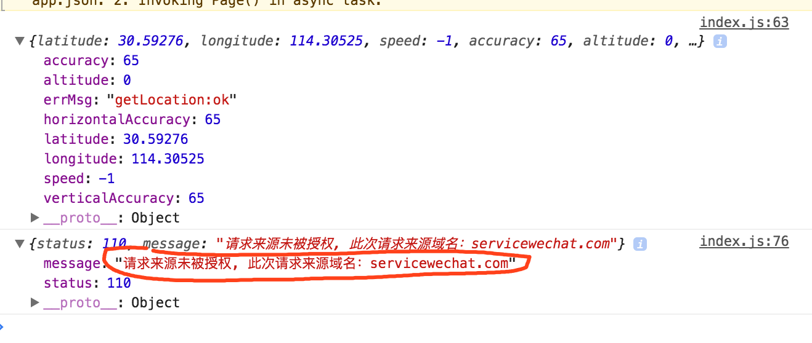
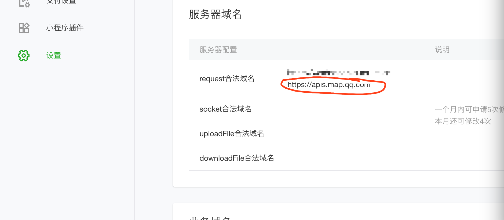
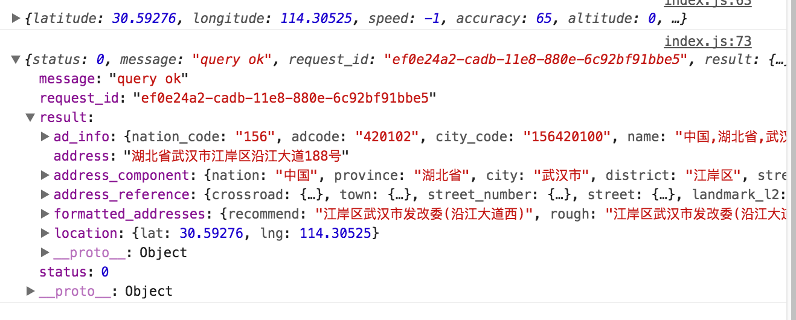
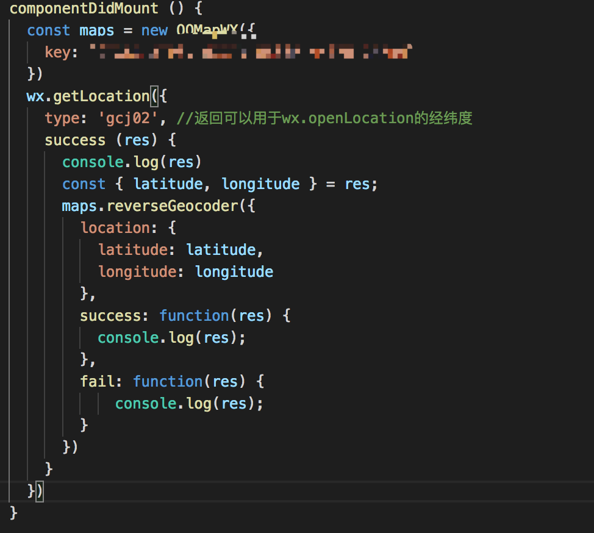

# 微信小程序中通过腾讯地图进行逆地址解析报错message: "请求来源未被授权, 此次请求来源域名：servicewechat.com"

在小程序中获取定位具体信息时，**不要配置腾讯地图中的WebServiceAPI中的域名白名单什么**的，域名配置直接在小程序后台中配置(就是这个货https://apis.map.qq.com)，

**千万千万不要在设置域名白名单**

正确操作是在小程序的后台设置中设置域名

