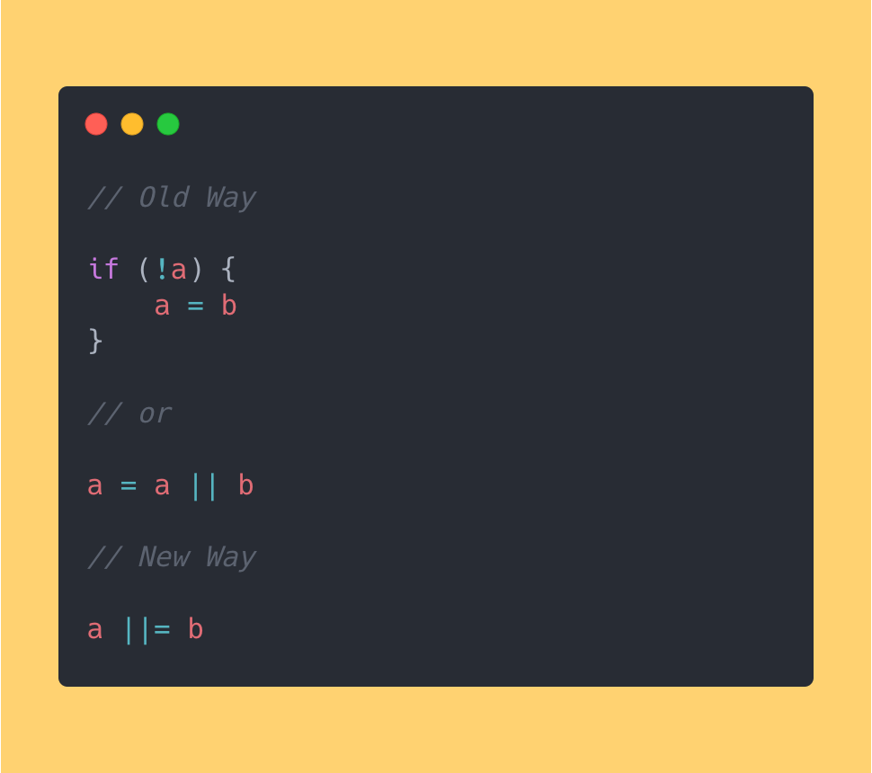
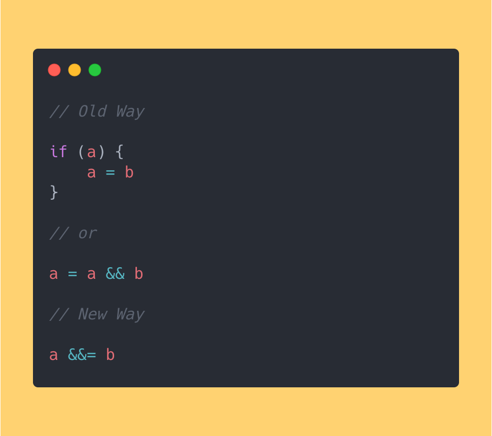
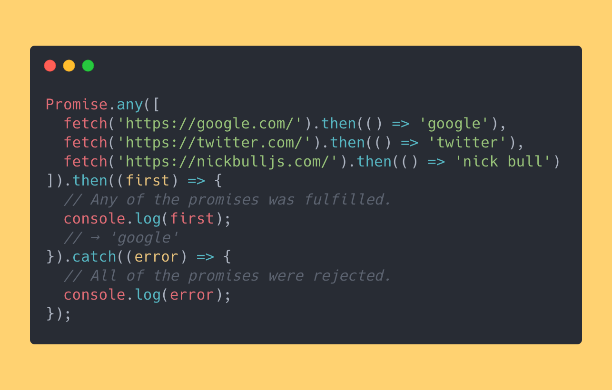
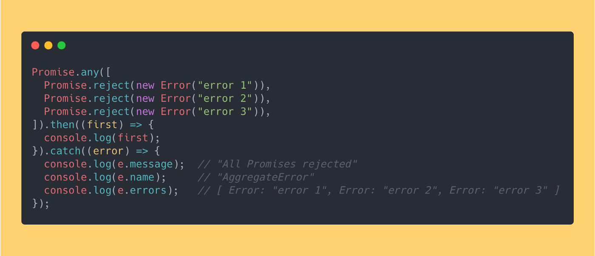
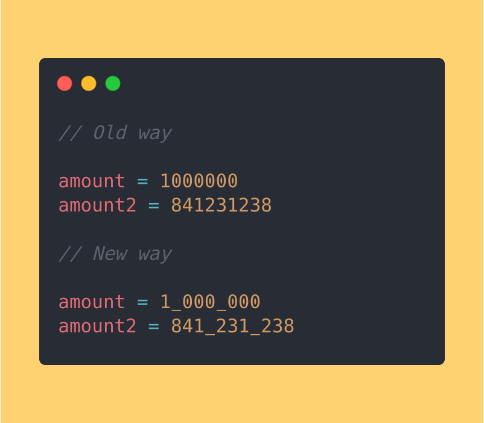

# 让人兴奋的三大JavaScript2021(ES12)新特性

> 文章译自[此处](https://medium.com/better-programming/the-top-3-new-javascript-es-2021-es-12-features-im-excited-about-a3ac129efbb2)

感谢Babel，我使用ECMAScript 2021的新功能已有一年多了。 几乎所有功能都是有用的，但是其中三个功能使我节省了大量时间，并使我的代码更具可读性，从而脱颖而出

让我们越过它们

## 1. 逻辑赋值运算符

逻辑赋值运算符将逻辑运算（例如??，&&或||）与赋值（例如=）结合使用

这里有些例子

`a ||= b`如果`a`为真，则返回`a`；如果`a`为虚假，则返回`b`

如果`a`为真或`a`为假，则`a &&= b`返回`b`

`a ??= b`如果`a`为`null`或`undefined`，则返回`b`；如果`a`为真，则返回`a`

最初，在代码审查期间立即了解这些操作员的操作有些棘手，但几周后，团队中的每个人都掌握了这些技巧

## 2. Promise.any

`Promise.any`接受一系列承诺并在任何提供的承诺被解决后立即解决

听起来很难，所以这里有个例子: 

我们同时提出三个要求。 当其中一个请求得到解决时，`Promise.any`也会解决该问题并将第一个已解决的请求记录在控制台中(在我们的示例中为Google)

如果所有的诺言都被拒绝，`Promise.any`将引发一种新型错误：`AggregateError`

最新消息是`AggregateError`对象表示一个错误，其中多个错误封装在一个错误中

外观如下:

e.errors是errors对象的数组

## 3. 数字分隔符

数字分隔符使我们能够用数字文字中的下划线（_）分隔数千个字符

有什么用？ 它使我们的代码更具信息性和可读性

这是一个例子:

## 结论

谢谢阅读！

如果您现在想尝试ES2021的这三个新功能，则可以使用以下Babel插件:

- [Logical assignment operator](https://babeljs.io/docs/en/babel-plugin-proposal-logical-assignment-operators)
- [Numeric separator](https://babeljs.io/docs/en/babel-plugin-proposal-numeric-separator)
