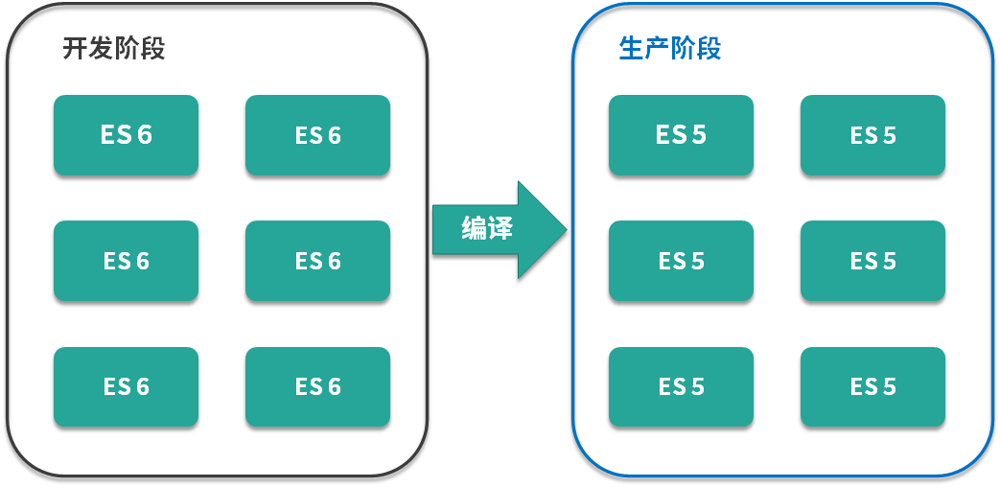
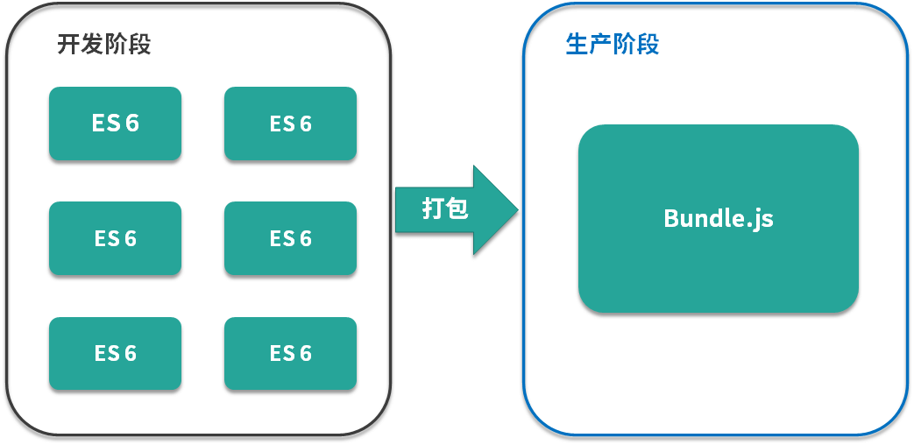
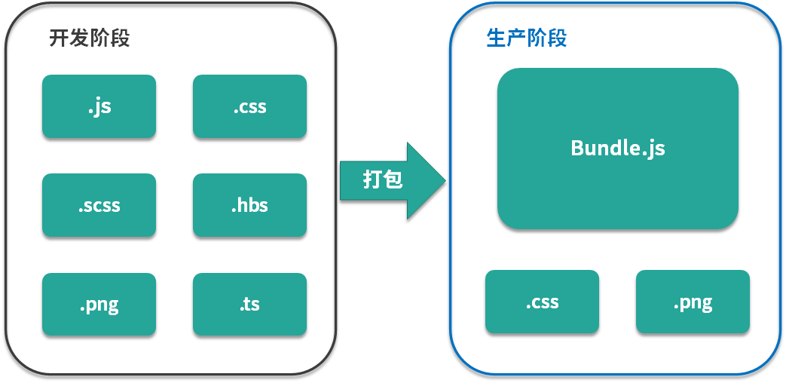

# webpack究竟解决了什么问题

webpakc最初的目标就是实现前端项目的模块化，解决的问题是在`前端项目中更高效的管理和维护项目中的每一个资源`

## 模块化的演进过程

### stage1 文件划分方式

> 基于文件划分的方式实现模块化

```javascript
  stage-1
    module-a.js
    module-b.js
    index.html
```

> 缺点：

- 模块直接在全局工作，大量模块成员污染了全局作用域
- 没有私有空间，所有的模块内的成员都可以在模块外部被访问或者修改
- 一旦模块增多，容易出现命名冲突
- 无法管理模块与模块间的依赖关系
- 在维护的时候不好分辨每个成员所属的模块

### stage2 命名空间方式

> 约定每个模块只暴露一个全局对象，所有模块成员都挂载到这个全局对象中

```javascript
  // module-a.js
  window.moduleA = {
    method1: function() {

    }
  }
```

```javascript
  // module-b.js
  window.moduleB = {
    method1: function() {
      
    }
  }
```

> 问题：

- 只解决了命名冲突问题，其他的问题还是存在

### stage3 IIFE

> 使用立即执行函数表达式为模块提供私有空间

```javascript
  // module-a.js

  ;(function () {

    var name = 'module-a'


    function method1 () {

      console.log(name + '#method1')

    }


    window.moduleA = {

      method1: method1

    }

  })()
```

> 问题：

- 带来了私有成员的概念，私有成员智能在模块成员内部通过闭包的形式访问，解决了前面提到的全局作用域污染和命名冲突的问题

### stage4 IIFE依赖参数

> 在IIFE的基础上，利用IIFE参数作为依赖声明使用，使得每一个模块之间的依赖关系变得更加明显

```javascript
  // module-a.js

  ;(function ($) { // 通过参数明显表明这个模块的依赖

    var name = 'module-a'


    function method1 () {

      console.log(name + '#method1')

      $('body').animate({ margin: '200px' })

    }

    window.moduleA = {

      method1: method1

    }

  })(jQuery)

```

## 模块加载的问题

- 需要手动引入模块，时间长了，新增或者移除某个模块，还要在HTML中删除引入，会引起很多不必要的麻烦

## 模块化规范的出现

- 一个统一的模块化标准规范
- 一个可以自动加载模块的基础库

### node

> node中采用`CommonJS`规范，每个模块都有单独的作用域，通过`module.exports`导出成员，通过`require`函数载入函数

- `CommonJS`约定是以同步的方式加载模块，node的执行机制是在启动时加载模块，执行过程中只是使用模块
- 在浏览器中如果采用`CommonJS`规范，同步的加载模式会引起大量的同步请求，运行效率低下

### 浏览器

> 浏览器环境中采用`AMD`规范，异步模块定义规范。基于AMD的require.js库

- `AMD`规范中约定每个模块通过`define()`函数定义，函数接收两个参数，第一个为数组，用于声明模块的依赖项，第二个为函数，参数与前面依赖项对应，每一项分别对应依赖模块的导出成员，这个函数的作用接收为当前模块提供一个私有空间

```javascript
  define(['module1', 'module2'], function($) {
    return {
      ...
    }
  })
```

## 模块化的标准规范

- 在node环境中， 采用`CommonJS`规范来组织模块
- 在浏览器环境中，采用`ES Modules`规范

## ES Modules 特性

```javascript
  // module.js
  const foo = 'xcc'
  export { foo }

  // app.js
  import { foo } from './module'
  console.log(foo)
```

### 模块打包工具的出现

> 模块化思想存在的新的问题：

- ES Modules模块系统本身存在`环境兼容`问题
- 模块化的方式划分的文件过多，在浏览器端，每一个文件都需要单独从服务器请求。零散的模块文件必然导致浏览器频繁的发送网络请求，影响效率
- 不仅仅存在js文件的模块化，还存在其他资源的模块化问题(css,png,mp3,webm...)

> 模块化工具的设想

- 具备编译代码的能力，能够把包含新特性的代码转化为能够兼容大多数环境的代码(es6 -> es5)



- 能够把散落的模块打包到以前，这样可以解决浏览器频繁请求模块文件的问题。开发阶段需要对模块进行划分，能够更好的组织代码。而在生产阶段，追求的是性能(module1.js + module2.js + ... => main.js)



- 需要支持不同类型资源以模块化的形式加载，别人图片，字体，样式等


