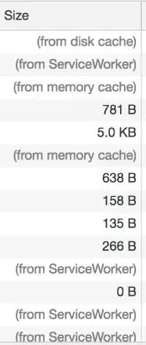
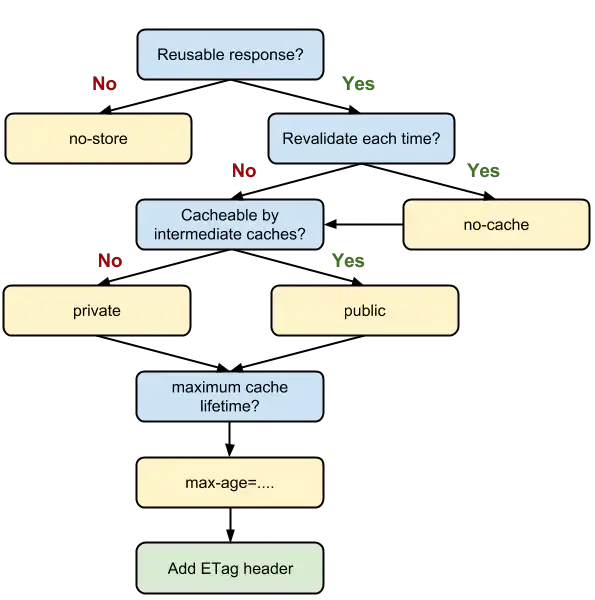

# 浏览器缓存机制介绍与缓存策略剖析

## 浏览器缓存的好处

1. 缓存可以减少网络IO消耗，提高访问速度
2. 通过网络获取内容速度缓慢又开销巨大，较大的响应需要在客户端与服务器之间多次往返通信，会延迟浏览器获得和处理内容的时间

## 浏览器缓存的分类和优先级

1. Memory Cache
2. Service Worker Cache
3. HTTP Cache
4. Push Cache

### 文件缓存查看方式

- 
- 类似于(from xxx)这样对应的资源，就是通过在缓存中获取到的
- from memory cache对应Memory Cache
- from ServiceWorker对应Service Worker Cache

## HTTP缓存机制探秘

1. 缓存分类
   - 强缓存(优先级高)
     - 强缓存原理
       - 强缓存利用HTTP头中的```Expires```和```Cache-Control```两个字段来控制的
       - 强缓存中，请求再次发出时，会根据这两个字段判断目标资源十分命中强缓存，命中就直接从缓存中获取资源，不会再与服务端发生通信
       - 强缓存命中后，HTTP状态码为200，```from disk cache```
     - 强缓存实现
       - expires和cache-control
         - expires
           - 在服务器返回响应是，在Response Headers中会写入过期时间expires
           - expires格式```expires: Wed, 11 Sep 2019 16:12:18 GMT```
           - 原理：当我们准备再次向服务器请求资源，浏览器会先对比本地时间和expires时间戳，本地时间小于expires，就直接取缓存中的这个资源
           - 问题：依赖本地时间，当本地时间被修改，达不到预期效果
         - Cache-Control
           - HTTP1.1新增Cache-Control字段来完成expires的任务
           - Cache-Control作为expires的完全替代方案，expires继续使用的目的在于**向下兼容**
           - Cache-Control格式```cache-control: max-age=3600, s-maxage=31536000```
           - **max-age**为一个时间长度，在这个时间范围内都有效
           - Cache-Control相比expires更加准确，**优先级更高**
           - **s-maxage**优先级高于max-age，两者同时出现时，优先考虑s-maxage，如果s-maxage为过期，则向代理服务器请求其缓存内容
           - s-maxage仅在代理服务器中生效，客户端中我们只考虑max-age
       - public和private
         - public和private是**针对资源能否被代理服务器缓存**而存在的一组对立概念，private为默认值
         - 资源设置public，那么既可以被浏览器缓存，又可以被代理服务器缓存
         - 资源设置private，则资源只能被浏览器缓存
       - no-store和no-cache
         - no-cache
           - 资源设置no-cache后，每一次发起请求都不会去询问浏览器的缓存情况，而是直接向服务端去确认该资源是否过期
         - no-store
           - 不使用任何缓存策略，也不与服务端确认缓存信息，而是直接向服务端发送请求
   - 协商缓存
     - 原理
       - 浏览器与服务器合作之下的缓存策略
       - 协商缓存依赖于服务端与浏览器端的通信
       - 协商缓存机制下，浏览器需要向服务器去询问缓存相关信息，进而判断是否重新发起请求，还是从本地获取缓存的资源
       - 如果提示缓存资源为改动，资源会被重定向到浏览器缓存，网络状态码为304(Not Modified)
     - 实现
       - Last-Modified到Etag
         - Last-Modified
           - 如果启用了协商缓存，会在首次请求的Response Headers中返回Last-Modified，为一个时间戳格式
           - Last-Modified格式```Last-Modified: Fri, 27 Oct 2017 06:35:57 GMT```
           - 后面我们每次请求，都会带一个```If-Modified-Since```字段，为上次返回的last-modified，服务器接收到时间戳后，会对比时间戳与服务器上资源最后修改时间是否一致，来判断资源是否发生变化
           - 缺点
             - 服务器没有正确感知文件的变化，包括修改时间与内容等
             - 编辑了文件，但是文件内容没发生改变，服务端不清楚是否真正改变了文件，但是修改时间发生改变，会重新请求资源
             - 修改文件速度过快(1s内)，If-Modified-Since只能检查以秒为最小单位的时间差，服务端感知不到资源改动，应该重新请求却没发起资源请求
         - Etag
           - 由服务器为每个资源生成的**唯一标识字符串**，服务器生成会有性能损耗
           - Etag格式```ETag: W/"2a3b-1602480f459"```
           - 下次请求会带一个```if-None-Match```的字符串供服务端对比，格式```If-None-Match: W/"2a3b-1602480f459"```
           - Etag是作为Last-Modified的补充和强化，优先级也更高
           - 缺点
             - 生成唯一标识会造成服务器性能损耗

2. HTTP缓存决策指南

   - 
   - 当我们的资源内容不可复用时，直接为 Cache-Control 设置 no-store，拒绝一切形式的缓存；否则考虑是否每次都需要向服务器进行缓存有效确认，如果需要，那么设 Cache-Control 的值为 no-cache；否则考虑该资源是否可以被代理服务器缓存，根据其结果决定是设置为 private 还是 public；然后考虑该资源的过期时间，设置对应的 max-age 和 s-maxage 值；最后，配置协商缓存需要用到的 Etag、Last-Modified 等参数

### MemoryCache

1. 指内存中的缓存，优先级上为浏览器最先去命中的一种缓存，效率上也是响应速度最快的缓存
2. 与渲染进程有关，当进程结算后(tab关闭)，内存数据被销毁
3. 内存资源有限，大体积的文件肯定不会写入内存中

### Service Worker Cache

1. 独立于主线程外的JavaScript线程，脱离于浏览器窗口，无法直接范文DOM
2. 独立使得Service Worker可以帮助我们实现离线缓存，消息推送和网络代理等功能
3. https协议中使用
4. 生命周期，被install后，会始终存在，只会在active与working之间切换，只能手动终止，这个为实现离线存储的先决条件
   - install
   - active
   - working

```javascript
  // 注册service worker
  window.naviagtor.serviceWorker.register('/test.js').then(
    function() {
      console.log('注册成功)
    }
  ).catch(err => {
    console.error('注册失败')
  })
```

```javascript
  // test.js
  // 要缓存文件test.html,test.css,test.js
  // Service Worker会监听 install事件，我们在其对应的回调里可以实现初始化的逻辑  
  self.addEventListener('install', event => {
    event.waitUntil(
      // 考虑到缓存也需要更新，open内传入的参数为缓存的版本号
      caches.open('test-v1').then(cache => {
        return cache.addAll([
          // 此处传入指定的需缓存的文件名
          '/test.html',
          '/test.css',
          '/test.js'
        ])
      })
    )
  })

  // Service Worker会监听所有的网络请求，网络请求的产生触发的是fetch事件，我们可以在其对应的监听函数中实现对请求的拦截，进而判断是否有对应到该请求的缓存，实现从Service Worker中取到缓存的目的
  self.addEventListener('fetch', event => {
    event.respondWith(
      // 尝试匹配该请求对应的缓存值
      caches.match(event.request).then(res => {
        // 如果匹配到了，调用Server Worker缓存
        if (res) {
          return res
        }
        // 如果没匹配到，向服务端发起这个资源请求
        return fetch(event.request).then(response => {
          if (!response || response.status !== 200) {
            return response
          }
          // 请求成功的话，将请求缓存起来。
          caches.open('test-v1').then(function(cache) {
            cache.put(event.request, response)
          })
          return response.clone()
        })
      })
    )
  })
```

### Push Cache

1. Push Cache是指HTTP2在server push阶段存在的缓存
2. Push Cache是缓存的最后一道防线，浏览器只有在Memory Cache，HTTP Cache和Service Worker Cache均未命中的情况下才会询问Push Cache
3. Push Cache是一种存在于会话阶段的缓存，当session终止是，缓存也会释放
4. 不同页面共享同一个HTTP2连接，那么就可以共享同一个Push Cache
