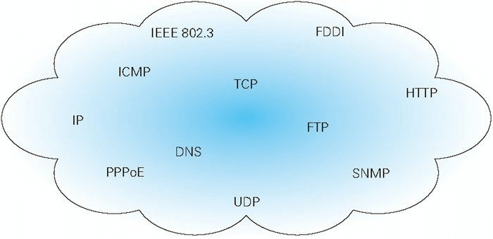
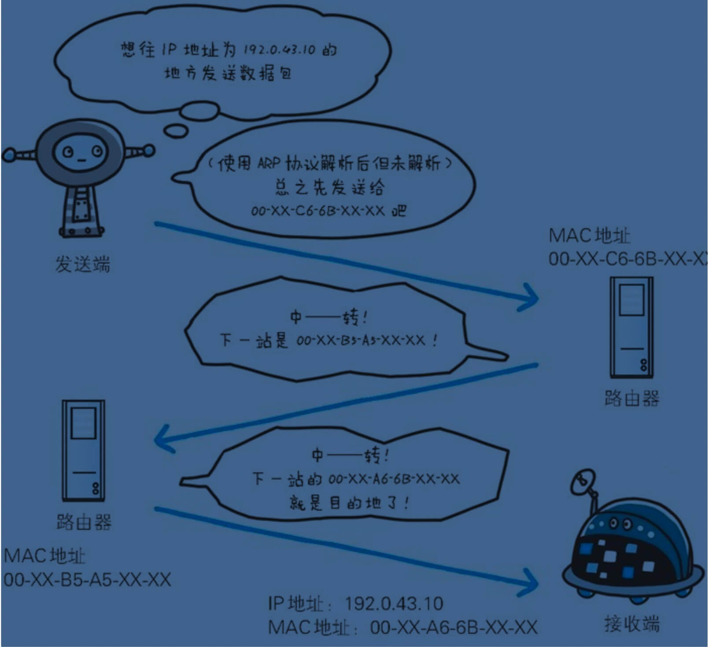
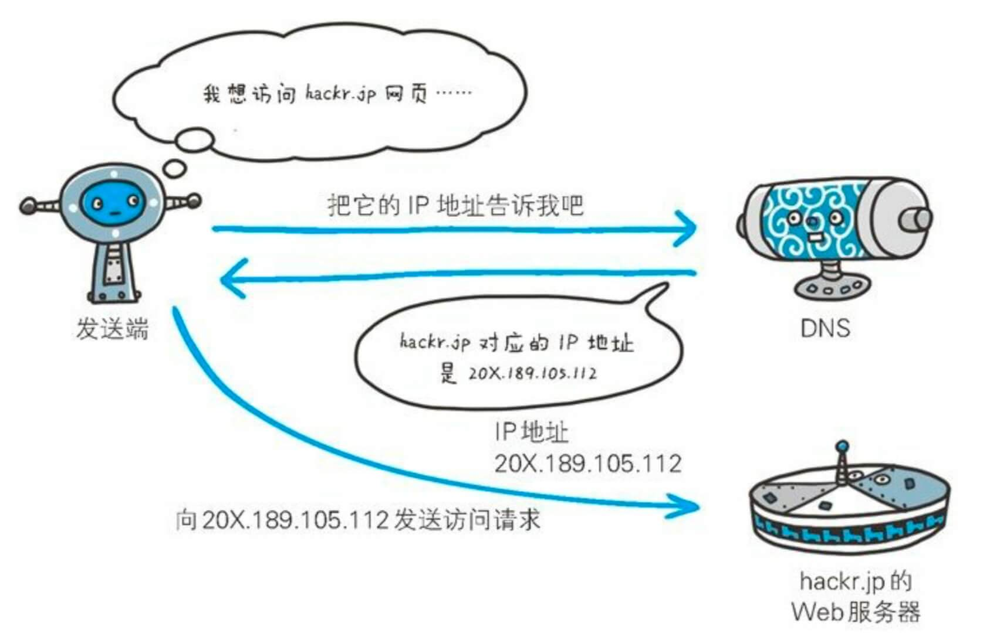

# 了解 web 及网络基础

## 1.1 使用 HTTP 协议任何访问 web

在网络浏览器的地址栏中输入 URL，web 页面是如何呈现的？

根据 web 浏览器中的 URL，客户端通过发送 HTTP 请求，浏览器从 web 服务器获取文件资源信息

HTTP 是超文本传输协议规范，完成从客户端到服务端的运作

## 1.2 HTTP 的诞生

### 1.2.1 为知识共享而规划 web

基本理念：借助多文档之间相互关联形成的超文本(HyperText)，连接可以相互参阅的 WWW(World Wide Web)

- WWW 包含

1. SGML(Standard Greneralized Markup Language-标准通用标记语言)作为页面文本标记语言的 HTML
2. 作为文档传递协议的 HTTP
3. 指定文档地址的 URL(Uniform Resource Locator-统一资源定位)

### 1.2.3 驻足不前的 HTTP

- HTTP/0.9: 1990 年问世
- HTTP/1.0: 1996 年 5 月，记载于 RFC1945 标准
- HTTP/1.1: 1997 年 1 月，修订版本 RFC2616

## 1.3 网络基础 TCP/IP

网络是在 TCP/IP 协议族的基础上运作的，而 HTTP 属于它内部的一个子集

### 1.3.1 TCP/IP 协议族

计算机与网络设备要相互通信，双方就必须基于相同的方法。不同的硬件，操作系统之间的通信，所有的这一切都需要一种规则。而这个规则称为协议(protocol)

协议中存在各种各样的内容，比如 IP 地址的选定，异地用户，建立通信的顺序，web 页面显示需要处理的步骤。像这样吧互联网相关联的协议集合起来总称为 TCP/IP

### 1.3.2 TCP/IP 的分层管理

- TCP/IP 协议族分层

1. 应用层
2. 传输层
3. 网络层
4. 数据链路层

#### 应用层

应用层决定了用户提供应用服务时通信的活动

TCP/IP 协议族预存了各类通用的应用服务，比如 FTP(File Transfer Protocol-文件传输协议)，DNS(Domain Name System-域名系统)。HTTP 协议也处于这一层

#### 传输层

传输层对上层应用层，提供处于网络连接中的两台计算机之间的数据传输

传输层有的协议

TCP(Transmission Control Protocol-传输控制协议)

UDP(User Data Protocol-用户数据协议)

#### 网络层

网络层是用来处理网络上流动的数据包，数据包是网络传输的最小数据单位。这一层规定通过怎么样的路径到达对方计算机，并把数据包传给对方

#### 链路层-又名数据链路层，网络接口层

用来处理连接网络的硬件部分，包括操作系统，硬件驱动，NIC(Network Interface Card，网络适配器即网卡)，以及光纤等物理可见部分

### 1.3.3 TCP/IP 通信传输流

> 通过TCP/IP协议族进行网络通信是，会通过分层顺序与对方进行通信。发送端从应用层网下走，接收端往应用层往上走

1. 客户端在`应用层`发出一个HTTP请求
2. 在`传输层`(TCP协议)，把接收的应用层数据(HTTP请求报文)进行分割，并且在每个报文上打上标记序号及端口号信息转发给网络层
3. `网络层`(IP协议)，增加作为通信目的地的MAC地址转发给链路层
4. 接收端在`链路层`接收到数据，按序往上层发送，一直到应用层

> 发出一个HTTP请求，会经过哪些步骤？

- 发送端-每通过一层，添加首部，接收端-每通过一层，删除首部。
- 发送端在层与层之间传输数据时，没经过一层会加上一个层所属的首部信息，接收端会在经过每一层时去掉对应首部

1. 客户端-应用层-HTTP数据
2. 客户端-传输层-HTTP数据+TCP首部
3. 客户端-网络层-HTTP数据+TCP首部+IP首部
4. 客户端-链路层-HTTP数据+TCP首部+IP首部+以太网首部
5. 服务端-链路层-HTTP数据+TCP首部+IP首部+以太网首部
6. 服务端-网络层-HTTP数据+TCP首部+IP首部
7. 服务端-传输层-HTTP数据+TCP首部
8. 服务端-应用层-HTTP数据

## 1.4 与HTTP关系密切的协议：IP、TCP和DNS

### 1.4.1 负责传输的IP协议

> IP协议的作用是把各种数据传送给对方。确保传送成功需要满足两个条件：IP地址和MAC地址

- IP地址指明了节点被分配到的地址，MAC地址是指网卡所属的固定地址。IP地址可以变换，但MAC地址基本不会发生改变
- 通过ARP协议，凭借MAC地址进行通信，ARP协议是一种解析地址的协议，根据通信双方的IP地址就可以反查出对应的MAC地址

### 1.4.2 确保可靠性的TCP协议

TCP位于传输层，用来提供可靠的字节流数据

> 字节流数据

字节流服务，是指为了放心传输，将大块数据分割成以报文段为单位的数据包进行管理

> TCP协议的三次握手策略

握手过程中使用了TCP的标志，`SYN`和`ACK`

1. 发送端发送一个带有SYN标志的数据包给对方
2. 接收方收到后，回传一个带有SYN/ACK标志的数据包表示收到信息
3. 发送端再回传一个带有ACK标志的数据包，代表握手结束

握手过程中出现莫名的中断时，TCP协议会再次以相同的顺序发送相同的数据包

## 1.5 负责域名解析的DNS服务

DNS服务和HTTP协议一样位于应用层的协议，用来一共域名到IP地址之间的解析服务

> 域名解析流程

1. 发送端发送域名到DNS服务
2. DNS服务返回域名对应的IP地址
3. 发送端通过IP地址访问对应服务

## 1.6 各种协议与HTTP协议的关系

> 输入url后发生了什么

1. 浏览器输入URL，域名
2. DNS服务通过输入的域名，返回域名对应的IP地址
3. 客户端通过IP地址访问服务端服务，当中会经历下面几步
4. HTTP协议生成针对目标web服务器的HTTP请求报文
5. TCP协议将报文分割为报文段，开始TCP三次握手
6. 第一次握手：发送带有SYN标志的数据到服务端
7. 第二次握手：服务端收到客户端的信息，发送带有SYN/ACK标志的信息到客户端
8. 第三次握手：客户端发送ACK到服务端，握手成功
9. IP协议通过服务端的IP地址，搜索对方IP，一边中转一边传送
10. 客户端-接收到发送来的报文段，重组报文段
11. 解析HTTP请求报文，到达指定服务器获取到资源
12. 请求的结果同样通过TCP/IP通信协议向用户回传

## 1.7 URI和URL
