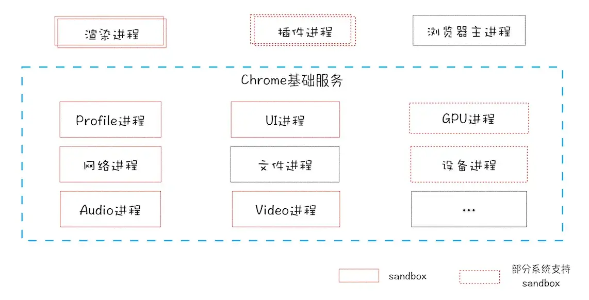

# Chrome架构：仅仅打开1个页面，为什么有4个进程

## 进程和线程

什么是并行处理？

计算机中并行处理就是同一时刻处理多个任务，可以大幅提升性能。

什么是进程？

一个进程就是一个程序运行的实例。启动一个程序时，操作系统会为该程序创建一块内存，用来存放代码、运行中的数据和一个执行任务的主线程，把这样的一个运行环境叫进程。

什么是线程？

线程是不能单独存在的，它是由进程来启动和管理的。同时，线程是依附于进程的，在进程中使用多线程并行处理能够提高运算效率。

### 进程与线程的特点

1. 进程中的任意一个线程执行出错，都会导致整个进程的崩溃
2. 线程之间共享进程中的数据
3. 当一个进程关闭后，操作系统会回收进程所占用的内存
4. 进程之间的内容相互隔离

## 单进程浏览器时代

单进程浏览器是指浏览器的所有功能模块运行在同一个进程里，这些模块包含了网络、插件、JavaScript运行环境、渲染引擎和页面等

### 单进程浏览器的缺点

1. 不稳定。插件的不稳定行会导致整个浏览器的崩溃
2. 不流畅。所有的任务都是执行在一个线程中的，同一时刻只有一个模块可以执行，同时，页面的内存泄漏也是让单进程变慢的重要原因
3. 不安全。同一进程间的数据是共享的，三方插件也可以轻松的回去系统权限

## 多进程浏览器

1. 由于进程之间是相互隔离的，所以一个页面或者插件的崩溃，只会影响到当前的页面进程和插件进程
2. 对于不流畅的问题，JavaScript是运行在渲染进程中，即使JavaScript阻塞了渲染进程，影响到的也只是当前渲染的页面
3. 对于不安全的问题，多进程架构的好吃是可以使用安全沙箱

## 当前浏览器的进程架构

1. 浏览器进程。主要负责界面显示、用户交互、子进程管理，同时提供存储等功能
2. 渲染进程。核心任务是将HTML、CSS、JavaScript转换为用户可以交互的网页，v8就是运行在该进程中
3. GPU进程。用来实现3D效果
4. 网络进程。负责网络资源的加载
5. 插件进程。负责插件的运行，不同插件之间进程隔离

### 多进程架构带来的缺点

1. 更高的资源占用
2. 更复杂的体系架构

## 面向未来的服务架构

