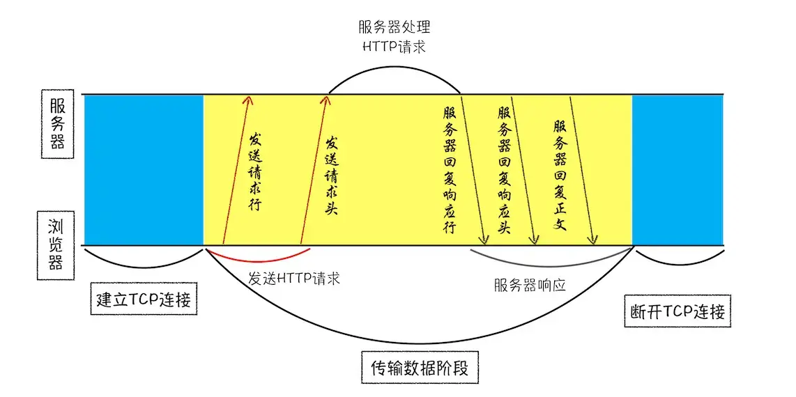
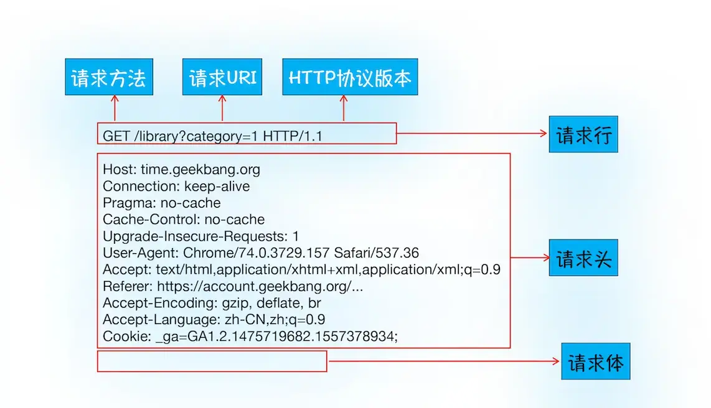
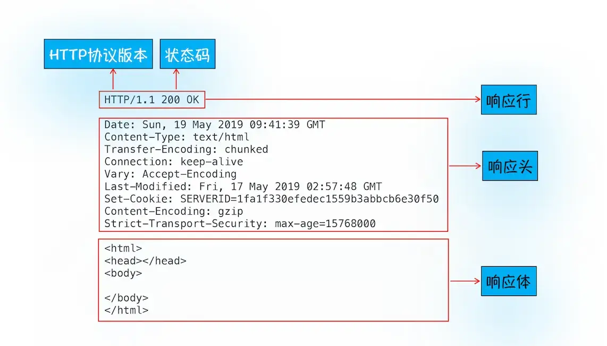
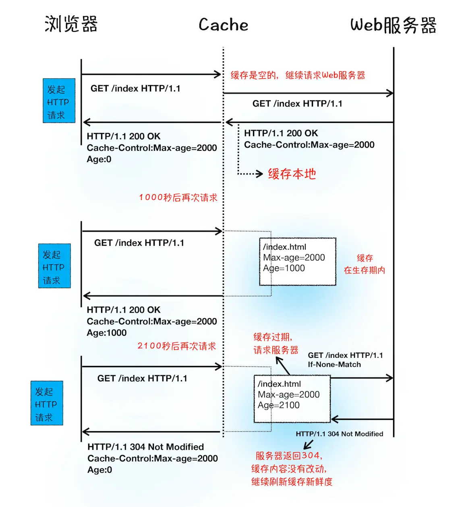
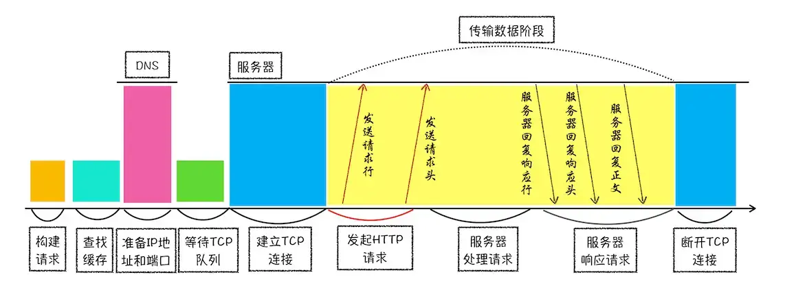

# 03-HTTP请求流程：为什么很对站点第二次打开速度很快

一个TCP连接包含了建立连接、传输数据和断开连接三个阶段，HTTP协议是建立在TCP协议之上的。HTTP是一种允许浏览器向服务器获取资源的协议，是web的基础，同时HTTP协议也是浏览器使用最广的协议。

浏览器访问网页的一些常见疑惑点：

- 为什么第一次访问一个站点是，打开的速度很慢，当再次访问这个站点时，速度就很快了？
- 当登录一个网站后，下次再次访问该站点，就已经处于登录状态了，这是怎么做到的？

## 浏览器端发起HTTP请求流程

### 构建请求

浏览器构建请求行

```javascript
GET /index.html HTTP1.1
```

### 查找缓存

浏览器缓存是一种在本地保存资源副本，以提供下次请求时直接使用的技术。

发出请求时，先检查浏览器缓存中是否有要请求的文件，当浏览器发现请求的资源在浏览器缓存中存在副本，它会拦截请求，返回该资源的副本，并直接结束请求，而不会去源服务器重新下载。好处有下面几点：

- 缓存服务器端压力，提升性能(获取资源耗时更短)
- 对于网页，缓存是实现资源快速加载的重要组成部分

### 准备IP地址和端口

浏览器使用HTTP协议作为应用层协议，先封装请求文本，并使用IP/TCP作为传输层协议发到网络上，所以在HTTP工作开始之前，浏览器需要通过TCP与服务器建立连接。HTTP的内容是通过TCP的传输数据阶段来实现的。

同时，因为IP为数字，不便记忆，所以一般通过域名进行访问，因此基于域名到IP有多了一个服务，即**域名到IP的映射关系，这套映射关系叫做域名系统，简称DNS**，获取端口时，如果不指定端口，HTTP协议默认80端口



### 等待TCP队列

Chrome有个机制，**同一域名最多只能建立6个TCP连接**，如果同一域名下同时有10个请求发生，会有4个进入排队等待状态，直到进行中的请求完成

### 建立连接

三次握手

### 发送HTTP请求



发送请求时，浏览器会向服务器发送请求行，包含请求方法、请求URL和HTTP版本协议。

发送**请求行**就是告诉服务器浏览器需要什么资源，常用Get获取资源，POST向服务器发送数据。

发送请求头信息是，会把浏览器的基础信息告诉服务器，比如操作系统、浏览器内核，以及当前请求的域名、浏览器端Cookie等信息

## 服务器端处理HTTP请求流程

### 返回请求

可以用个curl命令来查看返回请求数据

```javascript
curl -i  https://time.geekbang.org/
```

请求返回信息如图：



服务器返回：

- **响应行**，包括协议版本和状态码，服务器会通过状态码来告诉浏览器它的处理结果，比如200表示请求成功，404表示没找到页面
- **响应体**：包含了HTML的实际内容

### 断开连接

正常情况下，服务器向客户端返回数据后就要关闭TCP连接。不过如果浏览器或者服务器在头信息中加入了：

```javascript
Connection:Keep-Alive 
```

那么TCP连接在发送后还是会保持连接状态，这样浏览器就可以通过同一个TCP连接发送请求。**保持TCP连接可以省去下次请求需要建立连接的时间，提示资源加载速度**，新的HTTP2中，默认采用了长连接的方式

### 重定向

比如你打开geekbang.org这个网站，实际打开的是https://www.geekbang.org，你会发现此时响应行状态码为301，301就是告诉浏览器我要重定向到另外一个网址

## 问题解答

1. 为什么很多站点第二次打开速度会很快？

网页第二次打开快，主要原因是第一次加载页面的过程中，缓存了一些耗时的数据，主要包括DNS缓存和页面资源缓存两部分。

- DNS缓存：缓存的域名与IP的映射关系
- 页面资源缓存：图片、HTML、文件的缓存



在页面的缓存中，**服务器返回HTTP响应头，浏览器通过HTTP响应头中的Cache-Control字段来设置是否缓存该资源，同时也会为资源设置一个过期时长，时长通过Cache-Control中的Max-age参数来设置**。

```javascript
Cache-Control:Max-age=2000
```

如果缓存过期了，浏览器会在发送网络请求时，在HTTP请求头中带上：

```javascript
If-None-Match:"4f80f-13c-3a1xb12a"
```

服务器端通过If-None-Match的值来判断请求资源是否有更新

- 有更新，服务器返回最新资源给浏览器
- 没更新，返回状态码304，告诉浏览器这个缓存没更新，继续使用缓存数据

简单的说，很多网页二次打开秒开，是因为网站会把很多资源缓存到本地，浏览器缓存直接使用本地副本来回应请求，而不会产生真实的网络请求，节省了时间。同时DNS数据也被浏览器缓存，节省了DNS的查询时间

2. 登录状态是如何保持的？

- 在登录页面，用户输入登录信息，加密后通过POST请求发送信息到服务器
- 服务器收到请求信息，解密，在数据库查询登录信息进行验证。通过后生成一串字符串，把字符串写道返回响应头Set-Cookie中，发送给浏览器

```javascript
Set-Cookie: UID=3431uad;
```

- 浏览器收到响应头后，解析响应头，然后有Set-Cookie字段，会把Set-Cookie的信息保存到本地
- 用户再次发出请求，浏览器会在HTTP请求前读取Cookie数据，并把数据写入Cookie字段，然后发送给服务器

```javascript
Cookie: UID=3431uad;
```

- 服务器收到HTTP请求，查找Cookie信息，判断该用户是否登录状态，然后返回对应的数据返回给浏览器
- 浏览器接受数据，展示登录状态下信息

**如果服务器端发送的响应头内有 Set-Cookie 的字段，那么浏览器就会将该字段的内容保持到本地。当下次客户端再往该服务器发送请求时，客户端会自动在请求头中加入 Cookie 值后再发送出去。服务器端发现客户端发送过来的 Cookie 后，会去检查究竟是从哪一个客户端发来的连接请求，然后对比服务器上的记录，最后得到该用户的状态信息**

## 总结

HTTP请求示意图：



HTTP请求的几个阶段：

- 构建请求
- 查找缓存
- 准备IP和端口
- 等待TCP连接
- 建立TCP连接
- 发起HTTP请求
- 服务器处理请求
- 服务器返回请求
- 断开连接


