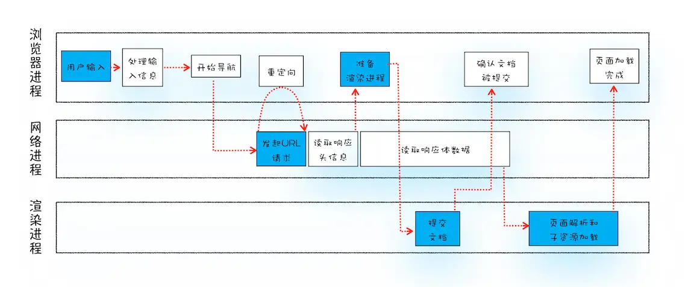

# 导航流程：从输入URL到页面展示，这中间发生了什么

从输入URL到页面完整展示完整流程示意图：



## 不同进程的职责与渲染的关系

- 浏览器进程主要负责用户交互、子进程管理和文件存储功能
- 网络进程是面向渲染进程和浏览器进程等提供网络下载功能
- 渲染进程主要职责是把下载下来的HTML、CSS、图片、JavaScript等资源解析为可以显示和交互的图片。因为渲染进程所有内容都是通过网络获取的，可能会存在以下恶意代码利用浏览器的漏洞对系统进行攻击，所以运行在渲染进程里的代码是不被信任的，渲染进程也是运行在安全沙箱中，保证了系统的安全

## 从输入URL到页面展示

### 用户输入

用户在地址栏输入关键字，地址栏判断输入内容是搜索内容还是请求的URL

- 如果是搜索内容，会使用默认浏览器合成带搜索关键字的URL
- 如果是URL，合成完成的URL，及包含协议等信息

### URL请求过程

浏览器进程通过进程间通信IPC把URL请求发送到网络进程。

- 网络进程中，先检查本地是否缓存了资源，有，直接返回资源，没有，进入网络请求流程。

- 请求前，进行DNS解析，获取请求域名的服务器IP地址。

- 如果请求协议是HTTPS，还需要建立TLS连接

- 建立TCP连接，浏览器会构建请求行、请求头信息，携带相关cookie等数据到请求头中，发送构建的请求信息

- 服务器收到请求信息，生成响应数据，并发给网络进程

  

  #### 1. 重定向

  浏览器接受到服务器响应头后，解析响应头。如果状态码为301、302，会进行**重定向**。如果状态码是200，表示浏览器可以继续处理该请求

  #### 2. 响应数据类型处理

  浏览器通过返回的Content-Type字段，判断服务器返回的响应体数据是什么类型。

  如果值是application/octet-stream，代表为字节流类型，通常浏览器会按照下载类型来处理该请求。

  如果是下载类型，请求会交给下载管理器，同时URL请求的导航流程结束。如果是HTML，浏览器会继续导航流程

  #### 3. 准备渲染进程

  通常情况下，浏览器会为每个页面分配一个渲染进程，但是在某些情况下，浏览器也会让多个页面运行在同一个渲染进程中。

  **同一站点：**同一站点是指根域名和协议一样即可

  ```javascript
  https://www.baidu.com
  https://ss.baidu.com
  http://www.baidu.com:8080
  ```

  **Chrome默认策略是，为每个标签对应一个渲染进程。但是如果从一个页面打开一个新页面，两个页面属于同一站点的话，那么新页面会复用老页面的渲染进程**

  #### 4. 提交文档

  提交文档就是浏览器进程将网络接收的HTML数据提交给渲染进程，流程如下：

  - 浏览器进程接收网络进程响应数据后，向渲染进程发起提交文档的消息
  - 渲染进程接收到提交文档消息后，会和网络进程简历传输数据的管道
  - 文档传输完成后，渲染进程返回确认提交消息给浏览器进程
  - 浏览器进程收到确认提交消息后，更新浏览器界面状态，更新web页面

  #### 5. 渲染阶段

  文档被提交，渲染进程就开始页面解析和子资源加载

## 总结

- 服务器可以根据响应头来控制浏览器的行为，比如跳转、网络数据类型判断
- Chrome默认每个标签一个渲染进程，但是如果页面属于同于站点，那么标签会使用同一个渲染进程
- 浏览器导航过程涵盖了从用户发起请求到提交文档给渲染进程的中间所有阶段


