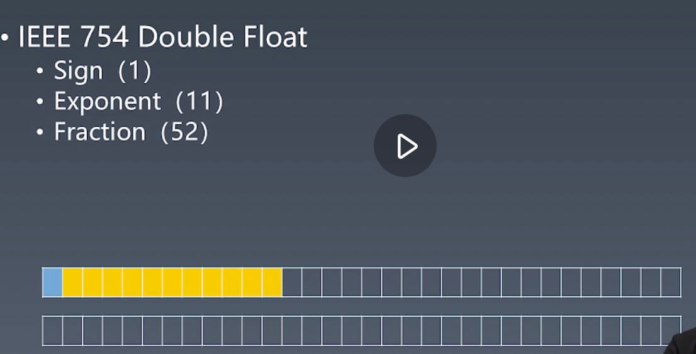

# js类型Number

## atom

| Grammar         | Runtime           |
| --------------- | ----------------- |
| literal         | types             |
| variable        | execution context |
| keywords        | -                 |
| whitespace      | -                 |
| line terminator | -                 |

## javascript的几种数据类型

- Number
- String
- Boolean
- Object
- Null - 有值为空
- Undefined - 没有设置值
- Symbol - 设置唯一索引
- Bigint (es10)

### 常见问题

- typeof null === 'object'

### Number

- IEEE 754 Double Float (双精度浮点类型)
  - Sign (1)
  - Exponent (11)
  - Fraction (52)

一个符号为+11个指数位+52个精度位

- 蓝色-符号位
- 黄色-指数为
- 白色-精度为
  


0.1的表示


0.2的表示


```javascript
  console.log(0.1 + 0.2 === 0.3) // false
````

10进制数转为2进制会有精度损失

### 常见写法

Number - Grammar

- DecimalLiteral
  - 0
  - 0.
  - .2
  - 1e3
- BinaryIntegerLiteral
  - ob111
- OctaIIntegerLiteral
  - 0o10
- HexIntegerLiteral
  - 0xFF

## 几个常见的问题

- 0.1 + 0.2 !== 0.3 // 10进制数转为2进制会有精度损失
- 0.toString() // 报错 - 0. 是一个合法的十进制写法，可以理解为0toString()
- 0 .toString() // 0空格.toString()会被理解为取属性运算符
