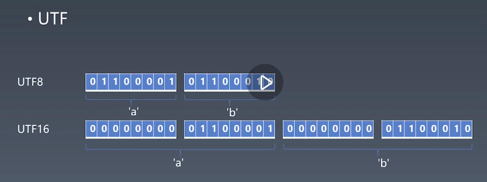
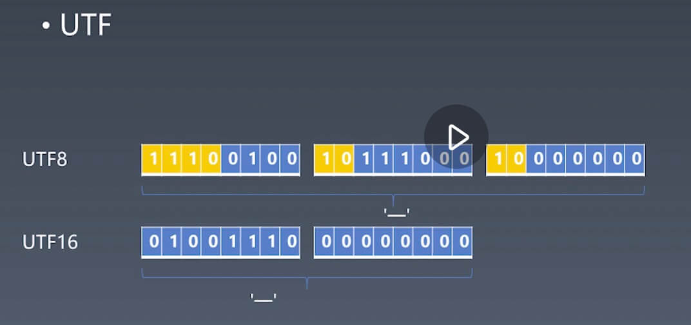

# js类型String

## 字符串

- Character - 字符
- Code Point - 数字 - 97代表a
- Encoding - 编码方式

### 字符集

- ASCLL
  - 127个字符
  - 0-9，a-z A-Z，字符
- Unicode
  - 联合字符集，包含所有的字符编码
  - 分片区
    - 汉子
    - 阿拉伯
  - 000-FFF
- UCS
  - 0000-FFFF
- GB
  - GB2312
  - GBK(GB13000)
  - GB18030
- ISO-8859
- BIG5

### Encoding

- UTF
  - UTF8
  - UTF16

- 字母的utf表示

- 中文的utf表示

## String - Grammar

### 写法

- "abc"
- 'abc'
- `abc`
  - `ab${x}abc${y}abc` (String Template语法)
    - `ab${
    - }abc${
    - }abc`
