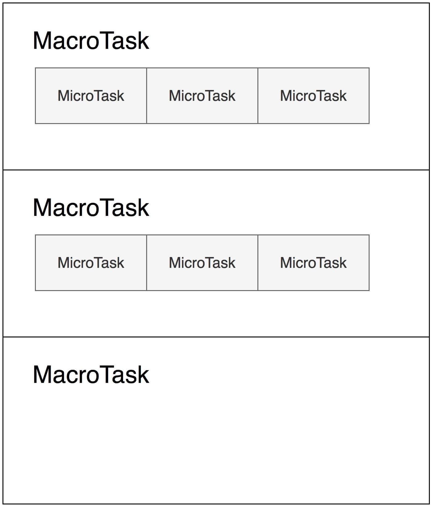

# JavaScript执行-promise里代码为什么比setTimeout先执行

## javascript执行流程

1. 把JavaScript代码，传递给JavaScript引擎
2. JavaScript引擎常驻内存中，等待我们的宿主把代码函数传递给它执行
3. 宿主任务：ES3及之前，JavaScript本身没有异步执行能力，JavaScript引擎会顺序执行代码，这个任务就是宿主发起的任务
4. ES5之后，JavaScript引入promise等，JavaScript引擎本身也可以发起任务
5. 宏观任务：`宿主发起的任务`
6. 微观任务：`JavaScript引擎发起的任务`

## 宏观任务及微观任务

1. 事情循环：JavaScript引擎等待宿主环境分配宏观任务，`通常等待的行为都是一个事件循环，node中这个部分称为事件循环`
2. 事件循环做的事情：反复“等待-执行”，每次执行的过程，其实都是一个宏观任务。可以理解为：宏观任务的队列就相当于事件循环
3. 宏观任务：MacroTask，微观任务：MicroTask
4. `Promise永远在队列尾部添加微观任务，setTimeout等宿主API，会添加宏观任务`
5. 宏任务与微任务执行过程：宏任务 -> 当前宏任务下的微任务队列 -> 宏任务 -> 当前宏任务下的微任务队列...

