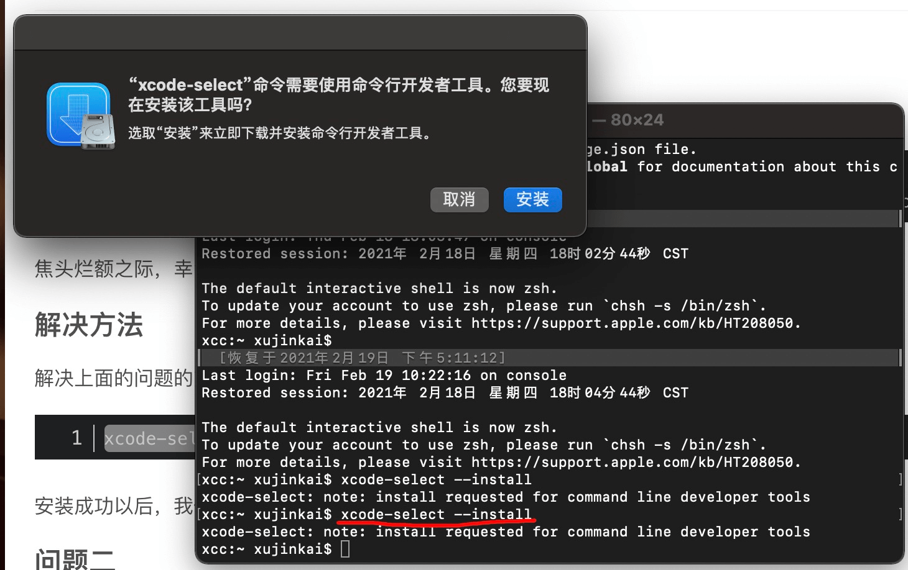

# mac在系统升级后，出现错误xcrun: error: invalid active developer path...

## 问题

在对mac做了系统升级后，打开vscode，使用git时，比如`git log`报下面的错误

```javascript
xcrun: error: invalid active developer path (/Library/Developer/CommandLineTools), missing xcrun at: /Library/Developer/CommandLineTools/usr/bin/xcrun
```

## 解决方法

打开命令行，运行

```javascript
  xcode-select --install
```

错误详情如下👇：




[参考链接](https://blog.csdn.net/zhangzehai2234/article/details/102493836)